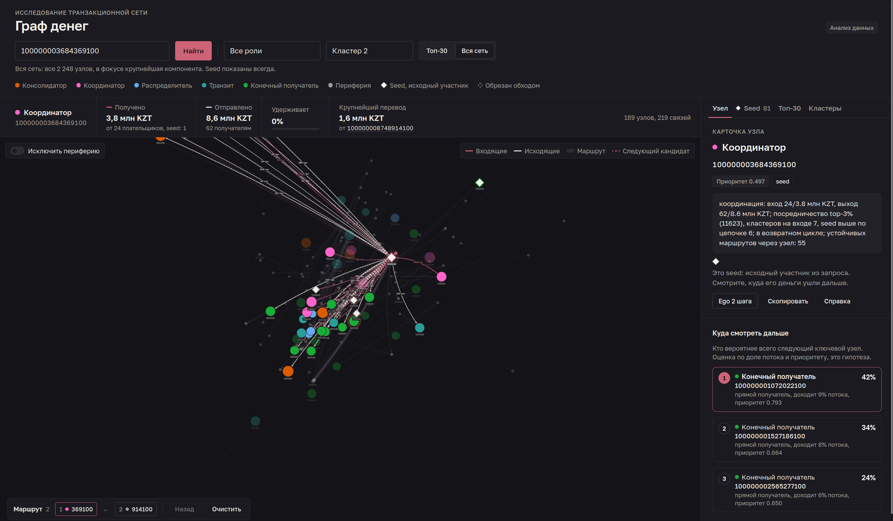
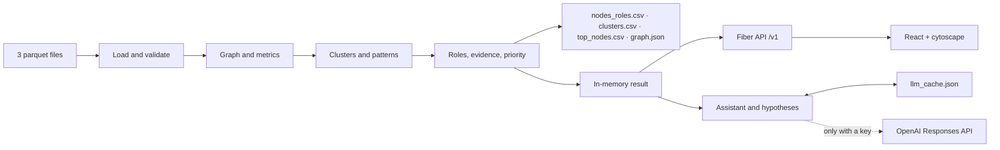

# Money Graph

[Русский](README.md) · [Қазақша (KZ)](README.kz.md) · **English (EN)**

**Explainable analysis of a bank transfer network for an AML analyst.**
Case "Money Graph: reconstructing the financial structure of an organised group from a transaction network",
**HackAlem AI** hackathon, team **Zzz Technology**.

The tool answers the analyst's question: **"which of the 2,248 clients should I look at first, and why"**.
Starting from a transfer graph built around 81 known participants (seeds), it assigns every node a role,
a cluster and a priority, writes a numeric justification, draws the network and lets you check any gid in ten seconds.

**Every conclusion is a hypothesis to verify, not evidence of wrongdoing.**

---

## Quick start for the jury

Only Docker with Compose is required, plus internet access during the build.

```bash
git clone https://github.com/BAITC-Hacks/hack-bf176827-zzz-technology.git
cd hack-bf176827-zzz-technology
docker compose up --build
```

After 1–3 minutes (build time) open **http://localhost:8080**. On start the container runs the pipeline,
validates the outputs and serves the UI together with the API. The three CSV files appear on the host in `out/`.
Stop with `docker compose down`.

Without Docker (Go 1.25+ required): `make demo` runs the pipeline, the check and the server with the built-in viewer.
For the React UI you also need Node.js 22+ and npm: `make demo-full`.

The pipeline finishes in **under a second**; no internet and no LLM key are needed to reproduce the results.

> [!IMPORTANT]
> **An OpenAI key unlocks the AI features.** Roles, priorities, clusters and the UI work without it.
> To ask the assistant new questions and get fresh node summaries, put the key into `.env` in the repository
> root **before starting**: `cp .env.example .env`, then `OPENAI_API_KEY=sk-...`. Docker and `make` pick it up
> automatically. Without a key the assistant only answers cached questions and the "Справка" button shows a template.
> Details: [Optional AI layer](#optional-ai-layer).

## Compliance with the brief

| Requirement | Where to verify |
|---|---|
| **Must have 1.** One run from parquet to three exports, < 5 min | `docker compose up --build` or `make demo`; log line "готово за …ms"; `out/nodes_roles.csv`, `out/clusters.csv`, `out/top_nodes.csv` |
| **Must have 2.** 2,248 rows, role from the dictionary, `role_score`, `evidence` | `make check` prints the role distribution and exits with code 0 |
| **Must have 3.** Role criteria are formal and explainable | Rule table below and in the [methodology](docs/methodology.md); the node card shows metrics, signals and evidence with numbers |
| **Must have 4.** Clusters: size, seeds, turnover, hypothesis | `out/clusters.csv`, the "Clusters" tab, `GET /v1/clusters` |
| **Must have 5.** Top ≥ 20 with justification and a screen showing flow direction | `out/top_nodes.csv` (30 rows), the "Top-30" tab, gid search, arrows and incoming/outgoing highlighting |
| Declared data limitations handled | Nodes cut off by the crawl are never sinks, seeds are never transit and are penalised in priority; see "Data traps" |
| Artifacts | Repository, README (ru/kz/en), three CSV files, [solution diagram](docs/scheme.png), [demo script](docs/demo.md) |
| Prohibitions | No hard-coded gids in the rules; no black boxes; no external client attributes; no cloud or paid services needed to reproduce |
| Optional | Crawl truncation, temporal patterns, cycles and routes, structuring, network resilience, AI assistant, node card, completeness assessment — [methodology](docs/methodology.md), sections 6–9 |

## What is implemented

**Analytics (Go, deterministic, < 1 s).**
- Loads three parquet files and validates them: aggregated edges match transactions by pair, count and sum.
- Node metrics: links and sums in both directions, pass-through share, PageRank (weighted, own implementation), HITS,
  betweenness, seeds paying directly and upstream, clusters on the input side, component, date-based signals
  (fast transit within 2 days, same-day payers, active days), return cycles, repeated routes, structuring.
- Six roles by rules with thresholds, `role_score`, Louvain clusters, percentile-based `priority_score`,
  `evidence` up to 200 characters with numbers.
- Network resilience: what happens when the top-5/10/20 nodes are removed.
- Export of three CSV files in the brief's schema plus `graph.json`; the `cmd/check` validator.

**User interface (React + cytoscape.js, served by the Go server).**
- Network map: arrow direction, colour = role, size = priority, seeds as diamonds, truncated nodes dashed;
  when a node is selected, incoming edges are red, outgoing dark, and the flow is animated with a running dash.
- Search by full gid or prefix, role and cluster filters, "Top-30" and "Whole network" modes,
  an "Exclude periphery" switch right on the map.
- Selected-node strip: role, received, sent, retained, largest transfer (clickable);
  hovering "Received" or "Sent" brings that direction to the front.
- Node card: evidence, badges, nearest seed upstream, "Where to look next" (three candidates),
  signals across 19 metrics relative to the whole network, incoming and outgoing with a separate "Periphery" group.
- Tabs "Seed" (81 initial participants and where their money went), "Top-30", "Clusters" with network resilience.
- A route of viewed nodes with numbers on the map, "Back" and "Clear", persisted between sessions.
- Notifications, empty states, loading skeletons, dark theme following the system setting.

**AI layer (optional, OpenAI).** A four-block node summary, cluster hypotheses, an assistant with eight graph
tools that knows the selected node and the route. Everything is cached in `out/llm_cache.json` (committed),
so the texts reproduce exactly without a key.



## How it works



1. The pipeline reads `data/*.parquet` and builds a directed weighted graph.
2. It computes metrics, clusters and patterns; rules assign roles, a formula assigns priority; CSV and `graph.json` are written.
3. The web server performs the same computation in memory at start-up and serves the API and the UI.
4. The analyst searches a gid or walks the top list, inspects links, justification, candidates and the cluster.
5. With a key they get a summary and can ask questions; without a key the same texts come from the cache.

Roles and priorities are computed by a local algorithm. The LLM receives ready facts and **does not assign**
roles, clusters or priorities. Two pipeline runs produce byte-identical files.

### Role criteria and thresholds

For each role a 0–1 score is computed by a thresholded rule; the node's role is the one with the highest score,
`role_score` is that score. If no rule reaches 0.5, the node is `peripheral`. Thresholds come from the data distributions.

| Role | Meaning | Condition | Score | Count |
|---|---|---|---|---|
| `consolidator` | collects from many and keeps the money | payers ≥ 3 | `min(1, in_deg/6) × (1 − min(1, pass_through))`, +0.15 if ≥ 2 seeds pay; ×0.7 if cut off by the crawl | 31 |
| `coordinator` | links groups, organiser candidate | in ≥ 2, out ≥ 2, betweenness ≥ P97, payers from ≥ 2 clusters or ≥ 3 seeds upstream | `0.5 + 0.5·(0.5·btw/P99 + 0.25·clusters/3 + 0.25·seeds/5)` | 43 |
| `distributor` | fan-out to many recipients | recipients ≥ 5 and ≥ 2·payers | `min(1, out_deg/30)`, ×0.6 if payers ≥ 3 | 16 |
| `transit` | passes money straight through | not a seed, has in and out, `0.7 ≤ pass_through ≤ 1.3` | `0.5 + 0.5·(1 − |pass_through − 1|/0.3) + 0.2·fast_forward_share` | 105 |
| `terminal` | money arrived and stayed, confirmed | no outgoing, node at hop ≤ 3 (the crawl went further), payers ≥ 2 or sum ≥ 100,000 | `0.5·min(1, in_kzt/500,000) + 0.5·min(1, in_deg/3)` | 153 |
| `peripheral` | no role signals | otherwise | `1 − max(others)` | 1,900 |

**Priority** is a weighted sum of percentile ranks across the network:
`0.25·P(in_kzt) + 0.20·P(in_deg) + 0.15·P(seeds upstream) + 0.15·P(pagerank) + 0.10·P(betweenness) + 0.15·role bonus`
(bonus: consolidator and coordinator 1.0, distributor 0.7, transit 0.5, terminal 0.4). Seeds ×0.5 — they are already known,
the target is who sits above them; nodes cut off by the crawl ×0.7 — incomplete data.

**Where the rules come from.** All of this is our own design: the organisers' starter code computed only degrees,
sums, PageRank and `pass_through`, while the brief supplied the role dictionary and the requirement of "a formal rule
with a threshold". Thresholds were chosen from quantiles of the data: ≥ 3 payers and ≥ 5 recipients are the top 5 % of
nodes, the 0.7–1.3 transit window covers the 72 nodes with pass-through 0.8–1.2, the betweenness threshold is P97.
Priority uses percentile ranks rather than raw values so that a single 23M transfer cannot dominate the other factors.
The weights follow the analyst's order of questions: where the money converges matters more than who mediates.
Robustness was checked: for every ±0.05 shift of the six weights (729 combinations) at least 7 of the top-10 nodes
stay (8.7 on average) and at least 26 of the top-30. It is a heuristic without training: there is no ground truth,
so quality is judged by the explainability of every decision.

**Evidence** is a phrase of up to 200 characters from a role template, e.g.:
`консолидация: получает от 8 плательщиков (из них seed: 2) 2.2 млн KZT, отдаёт дальше 24% (2 получ.); в возвратном цикле`
(consolidation: receives from 8 payers, 2 of them seeds, 2.2M KZT, passes on 24% to 2 recipients; part of a return cycle).

### Data traps and how they are handled

| Property of the export | Solution |
|---|---|
| 444 hop-4 nodes without outgoing transfers — the crawl simply stopped | `truncated` flag; never `terminal`, consolidator score ×0.7, priority ×0.7, note in evidence |
| 1,091 hop 1–3 nodes without outgoing — the crawl went further and found nothing | `verified_sink` flag; only they can be `terminal` |
| Seeds' incoming amounts are understated (the graph was built from them) | seeds cannot be `transit`; priority ×0.5 |
| 5,000 KZT threshold, structuring below it is invisible | `structuring` flag: ≥ 5 incoming transfers and ≥ 60 % of them under 15,000 KZT (45 nodes) |
| 16 components, 19 seeds without edges | `component_id` for every node; isolated seeds get their own `cluster_id` |

## Verification script for the jury

1. Run `docker compose up --build`. The container log shows the role distribution and "готово за …ms",
   then "http server started". `make check` has already passed inside.
2. Open http://localhost:8080. The initial view is the top-30 with neighbours. Top-left on the map is the
   "Exclude periphery" switch, top-right the flow legend.
3. Enter **`100000003115284100`** and press "Find". This is consolidator #1: **8 incoming** (2 seeds),
   **2 outgoing**, received **2,160,500 KZT**, sent **517,000 KZT**, retains 76 %.
   Incoming arrows are red, outgoing dark; the card shows evidence, the nearest seed 1 step away,
   three "Where to look next" candidates and metric signals.
4. Click a counterparty in the list or a candidate. The node joins the route at the bottom of the map and gets
   a number on the map. "Back" returns to the previous one.
5. Open the "Seed" tab: 81 initial participants and where their money went. The "Clusters" tab: resilience
   (removing the top-20 cuts 17 % of turnover, components 16 → 75) and 88 clusters with hypotheses.
6. Compare with `out/nodes_roles.csv`: gid, role and `evidence` match the UI.
   gids are 18-digit numbers; open them as text in Excel.

A one-minute walkthrough of five nodes and assistant questions: [docs/demo.md](docs/demo.md).

### Verification via the API

```bash
curl -f http://localhost:8080/v1/health
curl -f 'http://localhost:8080/v1/top?n=3'
curl -f http://localhost:8080/v1/nodes/100000003115284100
curl -f 'http://localhost:8080/v1/nodes/100000003115284100/ego?depth=2'
curl -f http://localhost:8080/v1/seeds
curl -f http://localhost:8080/v1/robustness
curl -f http://localhost:8080/v1/assistant/status
```

Swagger: http://localhost:8080/swagger/index.html. All gids in JSON are strings: values around 1e17 exceed
JavaScript's exact integer range.

### Automated checks

```bash
make pipeline   # out/*.csv, graph.json
make check      # 2248 nodes, roles from the dictionary, scores in [0,1], evidence ≤ 200, clusters, top ≥ 20
make test       # Go: analysis determinism, role constraints, graph filters, HTTP contracts, assistant tools
```

### Performance

Measured on the supplied dataset (2,248 nodes, 3,119 edges, 4,840 transfers), compiled binary, 5 consecutive runs:

| Metric | Result | Brief requirement |
|---|---|---|
| Full recomputation from parquet to three CSV files and `graph.json` | **0.29–0.33 s** | < 5 minutes |
| Peak memory (RSS) | ~60 MB | an ordinary laptop |
| Determinism | 5 runs produce byte-identical files | reproducibility |

Reproduce: `go build -o bin/pipeline ./cmd/pipeline && /usr/bin/time -v bin/pipeline --data data --out out`.
Go compilation and the React image build in Docker are not included in the measurement.

## Data and results

Supplied dataset: **1–31 July 2026**, **2,248 clients, 3,119 edges, 4,840 transfers, 81 seeds**,
turnover 365.9M KZT. Crawl from the seeds along outgoing transfers for 4 hops, intra-bank transfers ≥ 5,000 KZT only.

| File | Fields |
|---|---|
| `data/nodes.parquet` | `gid`, `depth`, `is_seed` |
| `data/edges.parquet` | `src`, `dst`, `sum_kzt`, `n_tx`, `depth` |
| `data/transactions.parquet` | `src`, `dst`, `date`, `sum_kzt` |

| Output | Schema |
|---|---|
| `out/nodes_roles.csv` | `gid,role,role_score,cluster_id,priority_score,evidence` + 20 metric columns |
| `out/clusters.csv` | `cluster_id,n_nodes,n_seed,sum_kzt_internal,top_gids,hypothesis` + component, cross-border flows, cycles, role mix |
| `out/top_nodes.csv` | `rank,gid,role,priority_score,why` — 30 rows |
| `out/graph.json` | `nodes, edges, clusters, top, robustness` for the UI |
| `out/llm_cache.json` | LLM response cache; committed so results reproduce without a key |

Result on the data: 88 clusters (8 with several seeds), a top-30 without a single seed, roles: 31 consolidator,
43 coordinator, 16 distributor, 105 transit, 153 terminal, 1,900 peripheral.

### HTTP API

| Method and path | Purpose |
|---|---|
| `GET /v1/health` | server availability |
| `GET /v1/graph?role=&cluster=&component=&top=30` | filtered graph; `top=N` — top-N and their neighbours, `top=0` — whole network |
| `GET /v1/nodes/{gid}` | card: metrics, percentiles, counterparties, nearest seed, candidates |
| `GET /v1/nodes/{gid}/ego?depth=1` | neighbourhood in both directions, depth 1–2 |
| `GET /v1/top?n=30` | priority top list |
| `GET /v1/clusters` | clusters with hypotheses |
| `GET /v1/seeds` | initial participants and their largest recipients |
| `GET /v1/robustness` | resilience when the top-5/10/20 are removed |
| `GET /v1/search?q=1000&limit=10` | gid prefix search |
| `GET /v1/assistant/status` | whether the LLM is available and which model |
| `GET /v1/nodes/{gid}/card` | text summary of a node (`by_llm: false` — template) |
| `POST /v1/assistant` | `{"question": "...", "gid": "...", "route": ["..."]}` → `{answer, gids[]}`; 503 without a key |
| `GET /graph.json` | latest export, the UI's fallback source |

## Optional AI layer

The only external integration is the **OpenAI Responses API**, default model `gpt-5.1`.
The key is set via the `OPENAI_API_KEY` environment variable or a `.env` file in the repository root
(template: `.env.example`, created by `make env`). For Docker the same `.env` next to `docker-compose.yaml`
is enough: compose passes the key into the container on `docker compose up`. Requests to the external API
contain only anonymised graph facts and gids.

```bash
cp .env.example .env            # then set OPENAI_API_KEY=sk-...
docker compose up --build       # or make demo — the key is picked up automatically
```

Without a key everything works except new assistant questions: roles, priorities, the UI, summaries and
hypotheses come from the cache or templates. The UI hides unavailable AI elements after a 503 response.

```bash
go run ./cmd/pipeline --data data --out out --llm    # request missing cluster hypotheses
go run ./cmd/ask --card 100000003115284100           # node summary
go run ./cmd/ask --q 'Who collects money from seeds 100000000343175100 and 100000003684369100?'
```

The LLM decides nothing about roles: the prompt requires it to reference gids only, phrase hypotheses,
and never attribute properties to clients that are not in the data.

## Technology

| Component | Implementation |
|---|---|
| Backend and CLI | Go 1.25, Fiber v2, Uber FX, Viper, zap, validator |
| Data and graphs | parquet-go, gonum (HITS, betweenness, Louvain), own deterministic PageRank |
| Frontend | React 19, Vite 7, cytoscape.js 3.30, CSS on design-system tokens, no CDN |
| API docs | swag, Swagger UI |
| AI | OpenAI Responses API, file cache |
| Run | Docker (single image, React built inside), Make |
| Storage | parquet, CSV, JSON; analysis result in memory, no database |

| Directory | Purpose |
|---|---|
| `cmd/pipeline`, `cmd/check`, `cmd/web`, `cmd/ask` | pipeline, validator, server, assistant CLI |
| `internal/data/models`, `internal/data/graph`, `internal/repo/dataset` | models, graph and index, parquet loading |
| `internal/services/analysis` | metrics, roles, clusters, priority, patterns |
| `internal/services/{pipeline,export,graph,hypotheses,assistant}` | orchestration, exports, API access, LLM scenarios |
| `internal/transport/http`, `internal/data/dto` | handlers and JSON contracts |
| `pkg/llm`, `pkg/httperr` | OpenAI client with cache, error format |
| `frontend` | React UI (`frontend/src`) |
| `web` | built-in fallback viewer |
| `docs` | methodology, demo script, diagram, swagger |
| `tests` | black-box analysis tests on real data |

## Settings

Non-secret settings live in `config/base.yaml`; any key can be overridden with an environment variable.

| Variable | Default |
|---|---|
| `APP_PORT` | `8080` |
| `APP_DATA_DIR` / `APP_OUT_DIR` | `data` / `out` |
| `APP_ENVIRONMENT` | `local`; `prod` in Docker |
| `OPENAI_API_KEY` | empty — LLM disabled |
| `LLM_MODEL` / `LLM_BASE_URL` | `gpt-5.1` / `https://api.openai.com/v1` |

If port 8080 is busy: `APP_PORT=8081 make demo`, or change `"8080:8080"` to `"8081:8080"` in `docker-compose.yaml`.
For UI development: `make web` in one terminal and `cd frontend && npm ci && npm run dev` in another
(http://localhost:5173, API proxied to 8080).

## Limitations

- Only the export is visible: no incoming transfers to seeds from outside, no transfers < 5,000 KZT, no flows beyond
  hop 4 or outside the bank. Missing outgoing transfers at hop 4 do not mean the money stayed there.
- Roles are thresholded rules, not labels. There is no ground truth, so quality is judged by explainability,
  not accuracy; `role_score` is rule confidence, not a probability of guilt.
- Clustering runs on the undirected projection; direction is used in roles, not in grouping.
- Anomaly detection is limited to the structuring rule.
- LLM texts may be wrong and must be checked against the facts; new questions require a key.
- No authentication: the configuration is meant for a local demo.

Which data are missing and which requests close the gaps: [methodology, section 9](docs/methodology.md).

## Scaling to ~1M nodes

What would change in the approach (implementation not required by the brief):

- **Storage.** In-memory parquet gives way to a columnar store or a graph database (Neo4j GDS, TigerGraph)
  or Spark GraphFrames; 1M nodes and ~5M edges still fit in Go memory, but recomputation stops being seconds.
- **Metrics.** Degrees, sums and PageRank are linear. Betweenness O(V·E) is replaced by source sampling
  (Brandes–Pich) or a local k-hop variant; cycles of length 3–4 only, and only around top candidates.
- **Clusters.** Louvain → Leiden, computed per component in parallel.
- **Incrementality.** New exports recompute only affected components; metrics are stored with versions,
  determinism is kept by a fixed traversal order.
- **UI.** The full graph is never drawn: ego subgraphs and cluster aggregates, server-side layout, gid index.
- **LLM.** The same assistant tools on top of the database; a response cache with TTL.

## Materials

- [Methodology](docs/methodology.md): data traps, metrics, role rules, clusters, priority, patterns, LLM, completeness, scaling.
- [Demo script](docs/demo.md): five nodes explained in a minute, assistant questions, answers to typical jury questions.
- [Solution diagram](docs/scheme.png): data → metrics → roles → interface.
- [Frontend for development](frontend/README.md).

No public deployment URL is provided; the demonstration method is a local run.
