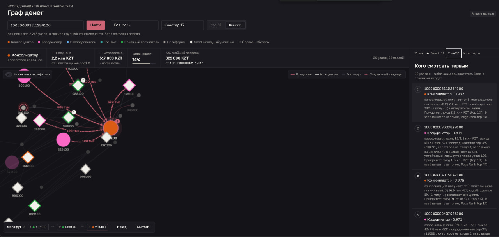
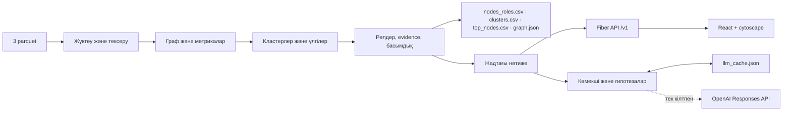
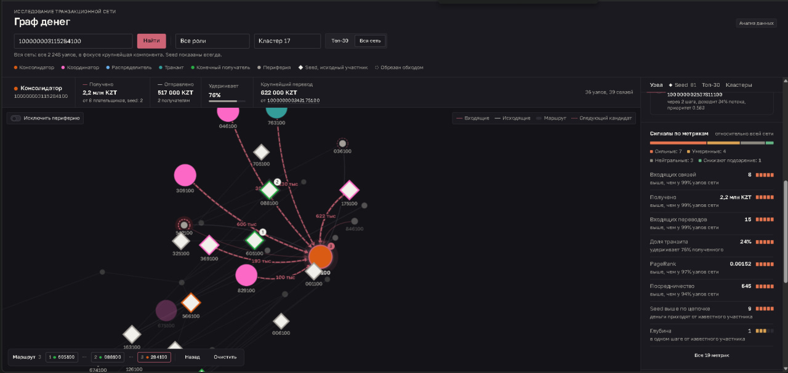
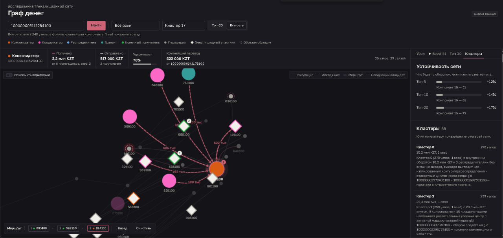
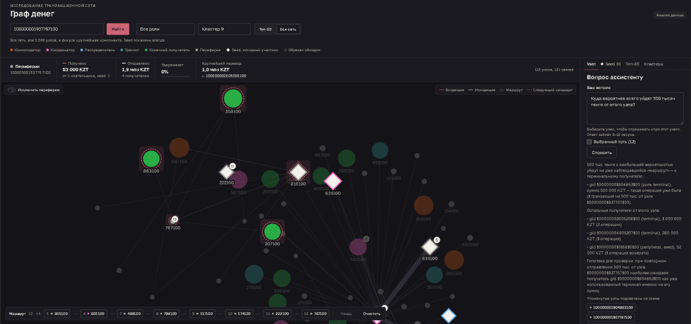

# Ақша графы

[Русский](README.md) · **Қазақша (KZ)** · [English (EN)](README.en.md)

**AML-талдаушыға арналған банк аударымдары желісінің түсінікті талдауы.**
Кейс «Ақша графы: транзакциялық желі бойынша ұйымдасқан топтың қаржылық құрылымын қалпына келтіру»,
**HackAlem AI** хакатоны, **Zzz Technology** командасы.

Құрал талдаушының сұрағына жауап береді: **«2 248 клиенттің қайсысын бірінші қарау керек және неге»**.
81 белгілі қатысушыдан (seed) құрылған аударымдар графы бойынша ол әр түйінге рөл, кластер және басымдық береді,
сандармен негіздеме жазады, желі сызбасын көрсетеді және кез келген gid-ті он секундта тексеруге мүмкіндік береді.

**Жүйенің барлық қорытындылары — тексеруге арналған гипотезалар, бұзушылықтың дәлелі емес.**

---

## Қазылар алқасына арналған жылдам бастау

Тек Compose-пен Docker және құрастыру кезінде интернет қажет.

```bash
git clone https://github.com/BAITC-Hacks/hack-bf176827-zzz-technology.git
cd hack-bf176827-zzz-technology
docker compose up --build
```

1–3 минуттан кейін (құрастыру) **http://localhost:8080** ашыңыз. Іске қосылғанда контейнер өзі пайплайнды,
шығарылымдарды тексеруді орындайды және API-мен бірге интерфейсті көтереді. Үш CSV хостта `out/` ішінде пайда болады.
Тоқтату: `docker compose down`.

Docker-сіз (Go 1.25+ қажет): `make demo` — пайплайн, тексеру және кіріктірілген қарау құралы бар сервер.
React-интерфейспен қосымша Node.js 22+ және npm қажет: `make demo-full`.

Пайплайн **бір секундтан аз** уақытта орындалады, нәтижені қайта алу үшін интернет те, LLM кілті де қажет емес.

> [!IMPORTANT]
> **OpenAI кілті AI-функцияларды ашады.** Рөлдер, басымдықтар, кластерлер және интерфейс онсыз да жұмыс істейді.
> Көмекшіге жаңа сұрақтар қою және түйіндер бойынша жаңа анықтамалар алу үшін кілтті **іске қосу алдында**
> репозиторий түбіріндегі `.env`-ге қойыңыз: `cp .env.example .env`, содан кейін `OPENAI_API_KEY=sk-...`.
> Docker мен `make` оны өздері алады. Кілтсіз көмекші тек кэштегі сұрақтарға жауап береді, ал «Справка» батырмасы
> үлгіні көрсетеді. Толығырақ — [Қосымша AI-қабат](#қосымша-ai-қабат) бөлімі.

## Техникалық тапсырмаға сәйкестік

| Талап | Қайдан тексеру |
|---|---|
| **Must have 1.** Parquet-тен үш шығарылымға дейін бір іске қосу, < 5 мин | `docker compose up --build` немесе `make demo`; логтағы «готово за …ms»; `out/nodes_roles.csv`, `out/clusters.csv`, `out/top_nodes.csv` |
| **Must have 2.** 2 248 жол, сөздіктегі рөл, `role_score`, `evidence` | `make check` рөлдердің үлестірімін басып шығарады және 0 кодымен аяқталады |
| **Must have 3.** Рөл критерийлері формалды және түсіндірілетін | Төмендегі ережелер кестесі және [методология](docs/methodology.md); түйін карточкасында метрикалар, сигналдар және сандары бар evidence |
| **Must have 4.** Кластерлер: өлшем, seed, айналым, гипотеза | `out/clusters.csv`, интерфейстегі «Кластеры» қойындысы, `GET /v1/clusters` |
| **Must have 5.** Негіздемесі бар топ ≥ 20 және ағын бағыты көрсетілген экран | `out/top_nodes.csv` (30 жол), «Топ-30» қойындысы, gid бойынша іздеу, кіріс/шығыс аударымдардың көрсеткілері мен жарықтандыруы |
| Деректердің айқын шектеулері ескерілген | Айналыммен кесілген түйіндер ағын соңы саналмайды, seed ешқашан транзит болмайды және басымдықта айыппұл алады, «Деректер тұзақтары» бөлімін қараңыз |
| Артефактілер | Репозиторий, README (ru/kz/en), үш CSV, [шешім сызбасы](docs/scheme.png), [демо сценарийі](docs/demo.md) |
| Тыйымдар | Ережелерде бірде-бір қатты кодталған gid жоқ; бірде-бір қара жәшік жоқ; клиенттердің сыртқы атрибуттары жоқ; қайта алу үшін бұлт пен ақылы қызметтер қажет емес |
| Қосымша | Айналым үзілуі, уақыттық үлгілер, циклдер мен маршруттар, сомаларды бөлшектеу, желі тұрақтылығы, AI-көмекші, түйін карточкасы, толықтықты бағалау — [методология](docs/methodology.md), 6–9 бөлімдер |

## Не іске асырылды

**Аналитика (Go, детерминирленген, < 1 с).**
- Үш parquet жүктеу және тексеру: агрегатталған қабырғалар транзакциялармен жұптар, саны және сомалары бойынша сәйкес келеді.
- Түйін метрикалары: екі бағыттағы байланыстар мен сомалар, транзит үлесі, PageRank (салмақты, өз іске асыруы), HITS,
  делдалдық, тікелей және тізбек бойынша жоғарыдағы seed-тер, кірістегі кластерлер, компонент, күндер бойынша белгілер
  (2 күн ішіндегі жылдам транзит, бір күнгі төлеушілер, белсенді күндер), қайтарым циклдері, тұрақты маршруттар,
  сомаларды бөлшектеу.
- Шектері бар ережелер бойынша алты рөл, `role_score`, Louvain кластерлері, процентильдер бойынша `priority_score`,
  сандары бар 200 таңбаға дейінгі `evidence`.
- Желі тұрақтылығы: топ-5/10/20 алынып тасталғанда не болады.
- ТТ схемасы бойынша үш CSV және `graph.json` экспорты; `cmd/check` шығарылым валидаторы.

**Интерфейс (React + cytoscape.js, Go-сервер арқылы беріледі).**
- Желі сызбасы: көрсеткілер бағыты, түс = рөл, өлшем = басымдық, seed ромб түрінде, кесілген түйіндер пунктирмен;
  түйін таңдалғанда кіріс қабырғалар қызыл, шығыс — қара, ағын жүгіретін пунктирмен анимацияланған.
- Толық gid немесе префикс бойынша іздеу, рөл мен кластер бойынша сүзгілер, «Топ-30» және «Вся сеть» режимдері,
  сызбаның өзінде «Исключить периферию» ауыстырғышы.
- Таңдалған түйін жолағы: рөл, алынған, жіберілген, ұсталған, ең ірі аударым (басуға болады);
  «Получено» немесе «Отправлено» үстіне апарғанда сол бағыт алдыңғы қатарға шығады.
- Түйін карточкасы: evidence, белгішелер, тізбек бойынша ең жақын seed, «Куда смотреть дальше» (үш кандидат),
  бүкіл желіге қатысты 19 метрика бойынша сигналдар, бөлек «Периферия» тобы бар кіріс және шығыс аударымдар.
- «Seed» (81 бастапқы қатысушы және олардың ақшасы қайда кетті), «Топ-30», желі тұрақтылығы бар «Кластеры» қойындылары.
- Сызбада нөмірлері бар қаралған түйіндер маршруты, «Назад» және «Очистить», сеанстар арасында сақталады.
- Хабарламалар, бос күйлер, жүктеу скелетондары, жүйелік баптау бойынша қараңғы тақырып.

**AI-қабат (қосымша, OpenAI).** Төрт блоктан тұратын түйін анықтамасы, кластер гипотезалары, граф бойынша сегіз
құралы бар және таңдалған түйін мен маршрут контекстін білетін көмекші. Барлығы `out/llm_cache.json` ішінде кэштеледі
(репозиторийде), сондықтан кілтсіз мәтіндер дәлме-дәл қайталанады.



*Топ-30: рөлдері, басымдықтары және негіздемелері көрсетілген тексеруге арналған үміткерлер.*

## Шешім қалай жұмыс істейді



1. Пайплайн `data/*.parquet` оқиды, бағытталған салмақты граф құрады.
2. Метрикаларды, кластерлерді және үлгілерді есептейді; ережелер рөлдерді, формула басымдықты тағайындайды; CSV мен `graph.json` жазады.
3. Веб-сервер іске қосылғанда сол есептеуді жадта орындайды және API мен интерфейсті береді.
4. Талдаушы gid іздейді немесе топ-тізім бойынша жүреді, байланыстарды, негіздемені, кандидаттарды және кластерді қарайды.
5. Кілт болса анықтама алады және сұрақ қояды; кілтсіз — кэштен сол мәтіндер.

Рөлдер мен басымдықтарды жергілікті алгоритм есептейді. LLM дайын фактілерді алады және рөлдерді, кластерлерді
немесе басымдықтарды **тағайындамайды**. Пайплайнның екі рет іске қосылуы байтқа дейін бірдей файлдар береді.

### Рөл критерийлері мен шектері



*Таңдалған түйіннің метрикаларын бүкіл желімен салыстыру оның рөлінің негіздемесін тексеруге көмектеседі.*

Әр рөл үшін шегі бар ереже бойынша 0–1 балл есептеледі; түйіннің рөлі — ең жоғары баллы бар, `role_score` — сол балл.
Егер бірде-бір ереже 0.5 жинамаса, түйін — `peripheral`. Шектер деректердің үлестірімдерінен алынған.

| Рөл | Мағынасы | Шарт | Балл | Саны |
|---|---|---|---|---|
| `consolidator` | көптен жинайды және ұстап қалады | төлеушілер ≥ 3 | `min(1, in_deg/6) × (1 − min(1, pass_through))`, ≥ 2 seed төлесе +0.15; айналыммен кесілгендерде ×0.7 | 31 |
| `coordinator` | топтарды байланыстырады, ұйымдастырушыға кандидат | кіріс ≥ 2, шығыс ≥ 2, betweenness ≥ P97, төлеушілер ≥ 2 кластерден немесе жоғарыда ≥ 3 seed | `0.5 + 0.5·(0.5·btw/P99 + 0.25·кластерлер/3 + 0.25·seed/5)` | 43 |
| `distributor` | көп алушыға желпуіш | алушылар ≥ 5 және ≥ 2·төлеушілер | `min(1, out_deg/30)`, төлеушілер ≥ 3 болса ×0.6 | 16 |
| `transit` | ақшаны тікелей өткізеді | seed емес, кіріс пен шығыс бар, `0.7 ≤ pass_through ≤ 1.3` | `0.5 + 0.5·(1 − |pass_through − 1|/0.3) + 0.2·fast_forward_share` | 105 |
| `terminal` | ақша келді және қалды, расталған | шығыс жоқ, түйін ≤ 3-ші қадамда (айналым әрі қарай жүрді), төлеушілер ≥ 2 немесе сома ≥ 100 000 | `0.5·min(1, in_kzt/500 000) + 0.5·min(1, in_deg/3)` | 153 |
| `peripheral` | рөл белгілері жоқ | басқаша | `1 − max(қалғандары)` | 1 900 |

**Басымдық** — желі бойынша процентильдік рангтердің салмақты қосындысы:
`0.25·P(in_kzt) + 0.20·P(in_deg) + 0.15·P(жоғарыдағы seed) + 0.15·P(pagerank) + 0.10·P(betweenness) + 0.15·рөл бонусы`
(бонус: consolidator және coordinator 1.0, distributor 0.7, transit 0.5, terminal 0.4). Seed ×0.5 — олар әлдеқашан белгілі,
мақсат — олардан жоғары тұрғандар; айналыммен кесілгендер ×0.7 — деректер толық емес.

**Ережелер қайдан алынды.** Мұның бәрі — біздің әзірлеме: ұйымдастырушылардың бастапқы коды тек дәрежелерді,
сомаларды, PageRank және `pass_through` есептеді, ал ТТ рөлдер сөздігін және «шегі бар формалды ереже» талабын берді.
Шектер деректердегі квантильдер бойынша таңдалды: ≥ 3 төлеуші және ≥ 5 алушы — түйіндердің жоғарғы 5 %-ы, 0.7–1.3
транзит терезесі өткізуі 0.8–1.2 болатын 72 түйінді қамтиды, делдалдық шегі — P97. Басымдық бір 23 млн сома басқа
факторларды басып тастамауы үшін шикі мәндер бойынша емес, процентильдер бойынша есептеледі. Салмақтар талдаушы
сұрақтарының ретін көрсетеді: ақша қайда жиналатыны делдалдың кім екенінен маңыздырақ. Тұрақтылық тексерілді: алты
салмақтың кез келген ±0.05 ығысуында (729 комбинация) топ-10-да кемінде 7 түйін (орташа 8.7), топ-30-да кемінде 26
түйін қалады. Бұл оқытусыз эвристика: ground truth жоқ, сондықтан сапа әр шешімнің түсіндірілуі арқылы тексеріледі.

**Evidence** — рөл үлгісі бойынша 200 таңбаға дейінгі фраза, мысалы:
`консолидация: получает от 8 плательщиков (из них seed: 2) 2.2 млн KZT, отдаёт дальше 24% (2 получ.); в возвратном цикле`
(консолидация: 8 төлеушіден, оның ішінде 2 seed, 2,2 млн KZT алады, 24 %-ын 2 алушыға әрі қарай береді; қайтарым циклінде).

### Деректер тұзақтары және олар қалай ескерілген

| Шығарылым ерекшелігі | Шешім |
|---|---|
| Шығысы жоқ 4-ші қадамдағы 444 түйін — айналым жай аяқталды | `truncated` жалауы; олар ешқашан `terminal` емес, консолидатор баллы ×0.7, басымдық ×0.7, evidence-те белгі |
| Шығысы жоқ 1–3 қадамдағы 1 091 түйін — айналым әрі қарай жүріп, ештеңе таппады | `verified_sink` жалауы; тек солар `terminal` бола алады |
| Seed-тердің кірістері төмендетілген (граф солардан құрылған) | seed `transit` бола алмайды; басымдық ×0.5 |
| 5 000 KZT шегі, одан төмен бөлшектеу көрінбейді | `structuring` белгісі: ≥ 5 кіріс аударым және олардың ≥ 60 %-ы 15 000 KZT-ге дейін (45 түйін) |
| 16 компонент, қабырғасыз 19 seed | барлығында `component_id`; оқшауланған seed-терге өз `cluster_id` |

## Қазылар алқасына арналған тексеру сценарийі

1. `docker compose up --build` іске қосыңыз. Контейнер логында: рөлдердің үлестірімі және «готово за …ms»,
   содан кейін «http server started». Ішінде `make check` өтіп кетті.
2. http://localhost:8080 ашыңыз. Бастапқы көрініс — көршілерімен топ-30. Сызбаның сол жақ жоғарғы бұрышында
   «Исключить периферию» ауыстырғышы, оң жақта ағындар легендасы.
3. **`100000003115284100`** енгізіп, «Найти» басыңыз. Бұл №1 консолидатор: **8 кіріс** (2 seed),
   **2 шығыс**, **2 160 500 KZT** алынған, **517 000 KZT** жіберілген, 76 % ұстап қалады.
   Сызбада кіріс көрсеткілері қызыл, шығыс — қара; карточкада — evidence, 1 қадамдағы ең жақын seed,
   үш «Куда смотреть дальше» кандидаты, метрикалар бойынша сигналдар.
4. Тізімдегі контрагентті немесе кандидатты басыңыз. Түйін сызбаның төменгі жағындағы маршрутқа қосылып,
   сызбада нөмір алады. «Назад» алдыңғысына қайтарады.
5. «Seed» қойындысын ашыңыз: 81 бастапқы қатысушы және олардың ақшасы қайда кетті. «Кластеры» қойындысы:
   тұрақтылық (топ-20 алып тастау айналымның 17 %-ын кеседі, компоненттер 16 → 75) және гипотезалары бар 88 кластер.
6. `out/nodes_roles.csv`-пен салыстырыңыз: gid, рөл, `evidence` интерфейспен сәйкес келеді.
   gid — 18 таңбалы сандар, Excel-де мәтін ретінде ашыңыз.

Бес түйінді «бір минутта» талдау және көмекшіге сұрақтар: [docs/demo.md](docs/demo.md).



*«Кластерлер» қойындысы: топтар туралы гипотезалар және топ-5/10/20 түйінді алып тастаудың айналым мен желі байланыстылығына әсері.*

### API арқылы тексеру

```bash
curl -f http://localhost:8080/v1/health
curl -f 'http://localhost:8080/v1/top?n=3'
curl -f http://localhost:8080/v1/nodes/100000003115284100
curl -f 'http://localhost:8080/v1/nodes/100000003115284100/ego?depth=2'
curl -f http://localhost:8080/v1/seeds
curl -f http://localhost:8080/v1/robustness
curl -f http://localhost:8080/v1/assistant/status
```

Swagger: http://localhost:8080/swagger/index.html. JSON-дағы барлық gid — жолдар: ≈ 1e17 мәндер
JavaScript-тің дәл бүтін сан диапазонына сыймайды.

### Автоматты тексерулер

```bash
make pipeline   # out/*.csv, graph.json
make check      # 2248 түйін, сөздіктегі рөлдер, [0,1] аралығындағы баллдар, evidence ≤ 200, кластерлер, топ ≥ 20
make test       # Go: талдаудың детерминизмі, рөл шектеулері, граф сүзгілері, HTTP-контрактілер, көмекші құралдары
```

### Өнімділік

Жеткізілген жиында өлшеу (2 248 түйін, 3 119 қабырға, 4 840 аударым), құрастырылған бинарлық файл, қатарынан 5 іске қосу:

| Метрика | Нәтиже | ТТ талабы |
|---|---|---|
| Parquet-тен үш CSV және `graph.json`-ға дейін толық қайта есептеу | **0,29–0,33 с** | < 5 минут |
| Ең жоғары жад (RSS) | ~60 МБ | қарапайым ноутбук |
| Детерминизм | 5 іске қосу байтқа дейін бірдей файлдар береді | қайта өндірілу |

Қайталау: `go build -o bin/pipeline ./cmd/pipeline && /usr/bin/time -v bin/pipeline --data data --out out`.
Go бинарлық файлдарын және Docker-дегі React образын құрастыру уақыты өлшеуге кірмейді.

## Деректер және нәтижелер

Жеткізілген жиын: **2026 жылғы 1–31 шілде**, **2 248 клиент, 3 119 қабырға, 4 840 аударым, 81 seed**,
айналым 365,9 млн KZT. Seed-терден шығыс аударымдар бойынша 4 қадамға айналым, тек банкішілік ≥ 5 000 KZT аударымдар.

| Файл | Өрістер |
|---|---|
| `data/nodes.parquet` | `gid`, `depth`, `is_seed` |
| `data/edges.parquet` | `src`, `dst`, `sum_kzt`, `n_tx`, `depth` |
| `data/transactions.parquet` | `src`, `dst`, `date`, `sum_kzt` |

| Нәтиже | Схема |
|---|---|
| `out/nodes_roles.csv` | `gid,role,role_score,cluster_id,priority_score,evidence` + 20 метрика бағаны |
| `out/clusters.csv` | `cluster_id,n_nodes,n_seed,sum_kzt_internal,top_gids,hypothesis` + компонент, шекара арқылы ағындар, циклдер, рөлдер құрамы |
| `out/top_nodes.csv` | `rank,gid,role,priority_score,why` — 30 жол |
| `out/graph.json` | интерфейс үшін `nodes, edges, clusters, top, robustness` |
| `out/llm_cache.json` | LLM жауаптарының кэші; нәтиже кілтсіз қайталануы үшін коммитталады |

Деректердегі қорытынды: 88 кластер (8-і бірнеше seed-пен), бірде-бір seed-сіз топ-30, рөлдер: 31 consolidator,
43 coordinator, 16 distributor, 105 transit, 153 terminal, 1 900 peripheral.

### HTTP API

| Әдіс және жол | Мақсаты |
|---|---|
| `GET /v1/health` | сервердің қолжетімділігі |
| `GET /v1/graph?role=&cluster=&component=&top=30` | сүзгілері бар граф; `top=N` — топ-N және олардың көршілері, `top=0` — бүкіл желі |
| `GET /v1/nodes/{gid}` | карточка: метрикалар, процентильдер, контрагенттер, ең жақын seed, кандидаттар |
| `GET /v1/nodes/{gid}/ego?depth=1` | екі бағыттағы қоршау, тереңдігі 1–2 |
| `GET /v1/top?n=30` | басымдықтар тобы |
| `GET /v1/clusters` | гипотезалары бар кластерлер |
| `GET /v1/seeds` | бастапқы қатысушылар және олардың ең ірі алушылары |
| `GET /v1/robustness` | топ-5/10/20 алынып тасталғандағы тұрақтылық |
| `GET /v1/search?q=1000&limit=10` | префикс бойынша gid іздеу |
| `GET /v1/assistant/status` | LLM қолжетімді ме және қай модель |
| `GET /v1/nodes/{gid}/card` | түйін бойынша мәтіндік анықтама (`by_llm: false` — үлгі) |
| `POST /v1/assistant` | `{"question": "...", "gid": "...", "route": ["..."]}` → `{answer, gids[]}`; кілтсіз 503 |
| `GET /graph.json` | соңғы шығарылым, интерфейстің резервтік көзі |

## Қосымша AI-қабат



*Көмекші граф деректеріне сүйеніп, ақша қозғалысы туралы сұраққа жауап береді; жауапта аталған түйіндер сызбада ерекшеленеді.*

Жалғыз сыртқы интеграция — **OpenAI Responses API**, әдепкі модель `gpt-5.1`.
Кілт ортадағы `OPENAI_API_KEY` айнымалысымен немесе репозиторий түбіріндегі `.env` файлымен беріледі
(үлгі — `.env.example`, оны `make env` жасайды). Docker үшін `docker-compose.yaml` жанындағы сол `.env` жеткілікті:
compose кілтті `docker compose up` кезінде контейнерге өзі береді. Сыртқы API-ге сұраныстарда тек граф туралы
жасырын фактілер мен gid-тер кетеді.

```bash
cp .env.example .env            # содан кейін OPENAI_API_KEY=sk-... жазыңыз
docker compose up --build       # немесе make demo — кілт автоматты түрде алынады
```

Кілтсіз көмекшіге жаңа сұрақтардан басқасының бәрі жұмыс істейді: рөлдер, басымдықтар, интерфейс, анықтамалар мен
гипотезалар кэштен немесе үлгі бойынша. Интерфейс 503 жауабы бойынша қолжетімсіз AI-элементтерді өзі жасырады.

```bash
go run ./cmd/pipeline --data data --out out --llm    # кэште жоқ кластер гипотезаларын сұрау
go run ./cmd/ask --card 100000003115284100           # түйін бойынша анықтама
go run ./cmd/ask --q 'Кто собирает деньги с seed 100000000343175100 и 100000003684369100?'
```

LLM рөлдер туралы ештеңе шешпейді: промпт тек gid-терге сілтеме жасауды, гипотеза түрінде тұжырымдауды және
клиенттерге деректерде жоқ атрибуттарды таңбауды талап етеді.

## Технологиялар

| Компонент | Іске асыру |
|---|---|
| Бэкенд және CLI | Go 1.25, Fiber v2, Uber FX, Viper, zap, validator |
| Деректер және графтар | parquet-go, gonum (HITS, betweenness, Louvain), өз детерминирленген PageRank |
| Фронтенд | React 19, Vite 7, cytoscape.js 3.30, дизайн-жүйе токендеріндегі CSS, CDN-сіз |
| API құжаттамасы | swag, Swagger UI |
| AI | OpenAI Responses API, файлдық кэш |
| Іске қосу | Docker (бір образ: React ішінде құрастырылады), Make |
| Сақтау | parquet, CSV, JSON; талдау нәтижесі жадта, ДҚ-сыз |

| Каталог | Мақсаты |
|---|---|
| `cmd/pipeline`, `cmd/check`, `cmd/web`, `cmd/ask` | пайплайн, валидатор, сервер, көмекші CLI |
| `internal/data/models`, `internal/data/graph`, `internal/repo/dataset` | модельдер, граф және индекс, parquet оқу |
| `internal/services/analysis` | метрикалар, рөлдер, кластерлер, басымдық, үлгілер |
| `internal/services/{pipeline,export,graph,hypotheses,assistant}` | оркестрация, шығарылымдар, API үшін қолжетімділік, LLM-сценарийлер |
| `internal/transport/http`, `internal/data/dto` | хендлерлер және JSON-контрактілер |
| `pkg/llm`, `pkg/httperr` | кэші бар OpenAI клиенті, қателер форматы |
| `frontend` | React-интерфейс (`frontend/src`) |
| `web` | кіріктірілген резервтік қарау құралы |
| `docs` | методология, демо сценарийі, сызба, swagger |
| `tests` | нақты деректердегі талдаудың black-box тесттері |

## Баптаулар

Құпия емес баптаулар — `config/config.yaml`, кез келген кілт орта айнымалысымен қайта анықталады.

| Айнымалы | Әдепкі |
|---|---|
| `APP_PORT` | `8080` |
| `APP_DATA_DIR` / `APP_OUT_DIR` | `data` / `out` |
| `APP_DEBUG` | `false`; `true` — түрлі-түсті dev-логтар және паника стектрейстері |
| `OPENAI_API_KEY` | бос — LLM өшірулі |
| `LLM_MODEL` / `LLM_BASE_URL` | `gpt-5.1` / `https://api.openai.com/v1` |

8080 порты бос емес болса: `APP_PORT=8081 make demo` немесе `docker-compose.yaml` ішінде `"8080:8080"`-ді `"8081:8080"`-ге ауыстырыңыз.
Интерфейсті әзірлеу үшін: бір терминалда `make web`, екіншісінде `cd frontend && npm ci && npm run dev`
(http://localhost:5173, API-ге 8080 арқылы прокси).

## Шектеулер

- Тек шығарылым көрінеді: seed-терге сырттан кіріс аударымдар жоқ, < 5 000 KZT аударымдар жоқ, 4-ші қадамнан
  әрі және банктен тыс ағындар жоқ. 4-ші қадамдағы түйінде шығыстың болмауы ақша қалды дегенді білдірмейді.
- Рөлдер — шектері бар ережелер, белгілеу емес. Ground truth жоқ, сондықтан сапа accuracy емес, түсіндірілу
  арқылы тексеріледі; `role_score` — ереже сенімділігі, кінә ықтималдығы емес.
- Кластерлеу бағытталмаған проекцияда; бағыт рөлдерде ескерілген, топтастыруда емес.
- Аномалияларды анықтау сомаларды бөлшектеу ережесімен шектелген.
- LLM мәтіндері қате болуы мүмкін және фактілер бойынша тексерілуі керек; кілтсіз жаңа сұрақтар қолжетімсіз.
- Авторизация жоқ: конфигурация жергілікті демонстрацияға арналған.

Қандай деректер жетіспейді және қандай сұраулар ақтаңдақтарды жабады — [методология, 9-бөлім](docs/methodology.md).

## ~1 млн түйінге дейін масштабтау

Тәсілде не өзгереді (ТТ бойынша іске асыру талап етілмейді):

- **Сақтау.** Жадтағы parquet бағандық қоймамен немесе граф ДҚ-мен (Neo4j GDS, TigerGraph) не Spark GraphFrames-пен
  ауыстырылады; 1 млн түйін мен ~5 млн қабырға Go жадына әлі сыяды, бірақ қайта есептеу секундтар болудан қалады.
- **Метрикалар.** Дәрежелер, сомалар және PageRank сызықты. O(V·E) betweenness көздерді іріктеу арқылы аппроксимациямен
  (Brandes–Pich) немесе жергілікті k-hop нұсқасымен ауыстырылады; циклдер — тек 3–4 ұзындықта және тек топ кандидаттарының айналасында.
- **Кластерлер.** Louvain → Leiden, компоненттер бойынша параллель есептеу.
- **Инкременттілік.** Жаңа шығарылымдар тек қозғалған компоненттерді қайта есептейді; метрикалар нұсқалармен сақталады,
  детерминизм бекітілген айналым ретімен сақталады.
- **Интерфейс.** Толық граф сызылмайды: ego-ішкі графтар және кластерлер бойынша агрегаттар, серверлік орналастыру, gid бойынша индекс.
- **LLM.** ДҚ үстіндегі сол көмекші құралдары; TTL-і бар жауаптар кэші.

## Материалдар

- [Методология](docs/methodology.md): деректер тұзақтары, метрикалар, рөл ережелері, кластерлер, басымдық, үлгілер, LLM, толықтық, масштабтау.
- [Демо сценарийі](docs/demo.md): «бір минутта» талданған бес түйін, көмекшіге сұрақтар, қазылар алқасының типтік сұрақтарына жауаптар.
- [Шешім сызбасы](docs/scheme.png): деректер → метрикалар → рөлдер → интерфейс.
- [Әзірлеуге арналған интерфейс](frontend/README.md).

Орналастырылған нұсқаның жария мекенжайы берілмейді; демонстрация тәсілі — жергілікті іске қосу.
