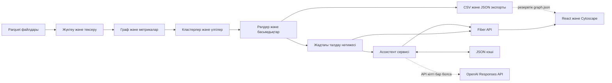

# Ақша графы — Граф денег

[Русский](README.md) · **Қазақша (KZ)** · [English (EN)](README.en.md)

**Банк аударымдары желісін қаржылық мониторинг үшін түсінікті түрде талдайтын құрал.**
**HackAlem AI** хакатонына арналған **Zzz Technology** командасының жобасы.

«Ақша графы» транзакциялар желісінде қай түйінді бірінші кезекте тексеру керегін
көрсетеді: қаражатты кім жинайды, кім әрі қарай өткізеді, кім алушыларға таратады,
кім топтарды бір-бірімен байланыстырады. Әр клиент бойынша рөлі, тексеру
басымдығы және бастапқы аударымдармен салыстыруға болатын негіздеме шығады.

**Мұнда шыққан нәтиже — тек тексеруге тұратын болжам, құқық бұзушылықтың дәлелі емес.**

## Не істей алады

- Үш Parquet файлын жүктеп, біріктірілген қырлардың бастапқы транзакцияларға
  сай келуін клиент жұбы, аударым саны және сомасы бойынша тексереді.
- Кіріс/шығыс байланыстар мен сомаларды, PageRank, HITS, аралық орталықтылықты
  (betweenness), транзит үлесін, seed түйіндерімен байланысты және белсенділіктің
  уақыт бойынша белгілерін есептейді.
- Алты рөлдің бірін таңдайды, `role_score` бағасын, кластерін, `priority_score`
  басымдығын анықтайды және мұны түсіндіретін `evidence` жазады.
- Louvain әдісімен кластерлейді, бес түйінге дейінгі тұйық циклдерді және
  қайталанатын A → B → C маршруттарын тауып, басым түйінді алып тастасаң
  желі қалай өзгеретінін көрсетеді.
- React интерфейсінде бағытталған граф көрсетеді: толық gid немесе оның
  префиксі бойынша іздеу, рөл мен кластер бойынша сүзгі, топ-30, клиент карточкасы,
  көршілерге бір басу арқылы өту, бір/екі қадамдық маңайды кеңейту, карточканы көшіру.
- Үш CSV мен `graph.json` шығарады, нәтижені өз алдына тексеретін валидаторы,
  HTTP API және Swagger құжаттамасы бар.
- Қаласаң, AI қосымша көмек береді: түйін туралы анықтама жазады, кластер
  бойынша болжам ұсынады, граф деректерін оқып сұраққа жауап қайтарады.

| Рөл | Дегеніміз |
|---|---|
| `consolidator` | Бірнеше төлеушіден қаражат жинап, елеулі бөлігін өзінде ұстайды |
| `transit` | Алынған қаражат көлемімен шамалас көлемді әрі қарай жібереді |
| `distributor` | Қаражатты бірнеше алушыға бөліп таратады |
| `terminal` | Осы деректер шеңберінде ақша тоқтайтын соңғы нүкте |
| `coordinator` | Түрлі топтарды бір-бірімен жалғайды, аралық орталықтылық көрсеткіші жоғары |
| `peripheral` | Басқа рөлге жатқызарлық анық белгі жоқ |


## Жүйе қалай жұмыс істейді

1. Пайплайн `data/nodes.parquet`, `edges.parquet` және `transactions.parquet` файлдарын оқиды.
2. Осы деректерден граф құрады да, метрика, кластер және аударым үлгілерін есептейді.
3. Рөлді ережелер бойынша тағайындайды; тексеру басымдығын метрикалардың
   перцентильдік рангына негізделген формула шығарады. Нәтиже `out/` қалтасына жазылады.
4. Веб-сервер бүкіл талдауды жедел жадта есептеп, оны API арқылы ұсынады.
5. Талдаушы топ-30 тізімін қарайды немесе gid енгізіп, карточканы ашады,
   аударым сомалары мен бағытын көреді, контрагентке өтіп, маңайды кеңейтеді.
6. Керек болса, түйін туралы қысқаша анықтама алады немесе ассистенттен сұрайды.

Рөл мен басымдықты жергілікті алгоритм есептейді — LLM бұған араласпайды.
Модельге тек дайын фактілер беріледі, ол рөл, кластер немесе басымдықты
**өзі шешпейді**.

Кластерлеу — аударым сомасымен салмақталған, бағытсыз проекция үстінде,
бекітілген random seed-пен жасалады. Басымдықты есептегенде кіріс көлемі,
төлеуші саны, тізбектің жоғарғы жағындағы seed түйіндер, PageRank, аралық
орталықтылық және рөл ескеріледі. Seed түйіндер мен аралаудың шеткі
нүктелеріне төмендететін коэффициент қолданылады. Формула, шектер мен
түсіндірмелер [әдістемеде](docs/methodology.md) толық жазылған (орыс тілінде).

## Қолданылған технологиялар

| Бөлік | Не қолданылған |
|---|---|
| Бэкенд пен CLI | Go, модуль нұсқасы `1.25.7` |
| HTTP, тәуелділік, баптау | Fiber v2, Uber FX, Viper, godotenv, zap, validator |
| Деректер мен граф алгоритмі | `parquet-go`, Gonum, метрика мен ереже — өз есептеуіміз |
| Фронтенд | JavaScript, React 19, Vite 7, Cytoscape.js 3.30.4, CSS |
| API құжаттамасы | swag / fiber-swagger |
| AI | OpenAI Responses API; әдепкі модель — `gpt-5.1` (`config/base.yaml`) |
| Құрастыру мен іске қосу | Make, Docker, Docker Compose; React жинағында Node.js қажет |
| Сақтау | Parquet, CSV, JSON; нәтиже жедел жадта тұрады, дерекқор жоқ |

Модель мен API мекенжайын `LLM_MODEL` және `LLM_BASE_URL` арқылы өзгертуге болады.
Cytoscape пен React жинаққа кіріп кетеді, сондықтан браузерге сыртқы CDN керек емес.

## Архитектурасы



Docker ішінде тек **бір `app` сервисі** жұмыс істейді. React бөлек кезеңде
жиналады, содан соң оны Go өзі 8080 портынан API-мен бірге тарата береді.
Сондықтан бөлек Nginx, Node сервері немесе Postgres қажет болмайды.

| Қалта | Не үшін |
|---|---|
| `cmd/pipeline`, `cmd/check`, `cmd/web`, `cmd/ask` | Талдау, экспортты тексеру, сервер, ассистент CLI |
| `internal/app`, `internal/config` | Тәуелділікті жинау және баптау |
| `internal/repo/dataset` | Parquet оқу мен тексеру |
| `internal/data/models`, `internal/data/graph` | Модельдер, граф, индекстер |
| `internal/services/analysis` | Метрика, рөл, кластер, басымдық, үлгі |
| `internal/services/pipeline`, `export`, `graph` | Жалпы орындалу, экспорт, нәтижеге қол жеткізу |
| `internal/services/assistant`, `hypotheses`, `pkg/llm` | AI логикасы, API клиенті, кэш |
| `internal/data/dto`, `internal/transport/http` | JSON форматтары, HTTP өңдеу |
| `frontend` | React коды; жиналған нұсқасы `frontend/dist` ішінде |
| `web` | Қосымша резервтік интерфейс пен тестілік граф |
| `data`, `out`, `docs`, `tests` | Кіріс деректер, нәтиже, құжат, тестілер |

## Орнату және іске қосу

### 1. Жобаны жүктеп алу

```bash
git clone https://github.com/BAITC-Hacks/hack-bf176827-zzz-technology.git
cd hack-bf176827-zzz-technology
```

Барлық команданы репозиторийдің түбір қалтасынан орында. Тәуелділікті бірінші
рет жүктегенде және Docker образын жинағанда интернет керек болады. Одан кейін
негізгі талдау мен графты қарау OpenAI кілтісіз-ақ жергілікті жұмыс істей береді.

### 2. Іске қосу жолын таңда

**Docker арқылы — Go мен Node.js орнатпай-ақ.** Тек Docker Engine/Desktop пен
Docker Compose қажет; Windows-та WSL қолдансаң, Docker Desktop-та WSL integration
қосулы тұрсын.

```bash
docker compose up --build
# Make орнатылған болса, қысқасы:
make docker
```

Образдың ішінде деректер, жиналған React және үш Go бинары бар. Контейнер
көтерілгенде пайплайн өздігінен жұмыс істейді, CSV тексеріледі, сервер қосылады.
Хосттағы `out/` қалтасы контейнермен байланысқан — нәтиже мен LLM кэші сонда сақталады.

**React-пен жергілікті іске қосу.** Керегі: Go **1.25.7+**, Node.js **22.12+**
(немесе 24), npm, Make.

```bash
make demo-full
```

Бұл команда фронтенд тәуелділігін орнатады, React-ті жинайды, содан соң
`pipeline → check → web` тізбегін кезек-кезек іске қосады. `-j` қоспай орында —
сервер тек интерфейс жиналып біткен соң ғана көтерілуі керек.

React бұрын жиналған болса, қайта іске қосу үшін:

```bash
make demo
```

`make demo` React-ті қайта жинамайды. `frontend/dist/index.html` табылмаса,
сервер өзінің қосымша `web/` интерфейсіне ауысады.

### 3. Қолданбаны аш

- Интерфейс: **http://localhost:8080**
- Swagger: **http://localhost:8080/swagger/index.html**
- Сервердің қолжетімділігін тексеру: **http://localhost:8080/v1/health**
- Талдау нәтижелері: **`out/`** қалтасында

Жергілікті процесс сол терминалда жұмыс істей береді, тоқтату үшін `Ctrl+C` бас.
Docker үшін: `docker compose down` немесе `make docker-down`.

### Фронтендпен жұмыс

Бірінші терминалда API көтер:

```bash
make web
```

Екінші терминалда:

```bash
cd frontend
npm ci
npm run dev
```

Vite http://localhost:5173 мекенжайында ашылады және сұрауларды 8080 портқа
өзі бағыттайды. Бэкенд басқа жерде тұрса, оны `API_PROXY_TARGET` арқылы көрсет.

### Баптаулар және WSL

Құпия емес баптаулар `config/base.yaml` мен `config/<APP_ENVIRONMENT>.yaml`
файлдарынан оқылады. Ең жиі өзгертілетіндер:

| Айнымалы | Әдепкі мәні / мақсаты |
|---|---|
| `APP_PORT` | `8080` — жергілікті Go серверінің порты |
| `APP_DATA_DIR` | `data` — кіріс файлдар қалтасы |
| `APP_OUT_DIR` | `out` — нәтиже мен кэш қалтасы |
| `APP_ENVIRONMENT` | `local`; Docker-де `prod` |
| `OPENAI_API_KEY` | Жаңа LLM сұрауы үшін керек, міндетті емес |
| `LLM_MODEL` | `gpt-5.1` |
| `LLM_BASE_URL` | `https://api.openai.com/v1` |

`.env` міндетті емес; `make env` оны `.env.example` үлгісінен жасайды, бірақ
тек файл болмаған жағдайда ғана. Кілт бастапқы кодқа жазылмайды. Compose ішінде
`OPENAI_API_KEY` тікелей беріледі; басқа баптауды өзгерткің келсе,
`docker-compose.yaml` ішіндегі `environment`-ті, ал портты ауыстырсаң, `ports`-ты да түзет.

WSL қолдансаң, `\\wsl.localhost\...` жолындағы Windows npm-ін емес, Node.js бен
Go-дың Linux нұсқасын қолдан. Егер `GOROOT` бұрыннан Windows жолын сақтап тұрса:

```bash
unset GOROOT
node -p 'process.platform'  # нәтижесі linux болуы керек
command -v node
command -v npm
make demo-full
```

8080 порты бос болмаса, алдыңғы процесті тоқтат немесе
`APP_PORT=8081 make demo-full` деп жергілікті іске қос та, http://localhost:8081 аш.

## Шешімді қалай тексеруге болады: қазылар алқасына жоспар

1. `make demo-full` немесе `docker compose up --build` іске қос.
   CSV тексерісі **2248 бірегей түйін** туралы хабармен аяқталады.
2. Интерфейсті аш. Алғашқы көрініс — көршілерімен бірге топ-30; түс рөлді,
   ромб seed түйінді, жебе аударым бағытын білдіреді.
3. **`100000003115284100`** енгізіп, Enter немесе «Найти» түймесін бас.
   Осы деректе бұл — `consolidator`: **8 кіріс** пен **2 шығыс** контрагенті бар,
   **2 160 500 KZT** алған, **517 000 KZT** жіберген. Карточка ашылып, оның
   барлық байланысы бөлектеніп көрінеді.
4. Карточкадан бір көршіні таңдап, «Ego 2 шага» бас. Басқа түйінге өтіп,
   маңай кеңейгенін көр.
5. Рөл мен кластер сүзгісін сынап көр. Екеуін де тазалап, «Вся сеть» бас:
   осы деректе **2248 түйін мен 3119 қыр** шығуы керек.
6. `out/nodes_roles.csv` файлын ашып, gid, рөл және негіздемені интерфейспен
   салыстыр. gid-ты жылжымалы үтірлі санға айналдырып алма — сан өзгеріп кетеді.

Клиент мысалдары мен көрсету кезінде қоюға болатын сұрақтар:
[docs/demo.md](docs/demo.md) (орыс тілінде).

### API арқылы тексеру

Сервер көтерілген соң, екінші терминалда орында:

```bash
curl -f http://localhost:8080/v1/health
curl -f 'http://localhost:8080/v1/top?n=3'
curl -f http://localhost:8080/v1/nodes/100000003115284100
curl -f 'http://localhost:8080/v1/nodes/100000003115284100/ego?depth=2'
curl -f http://localhost:8080/v1/assistant/status
```

Карточканың толық метрикасы `node.features` өрісінде берілген. JSON-дағы барлық
gid жол ретінде беріледі, себебі олардың мәні JavaScript дәл көрсете алатын
бүтін санның шегінен асып кетеді. Параметр қате болса — HTTP 400, түйін
табылмаса — 404 қайтады.

### Автотесттер

```bash
make pipeline
make check
make test
go build ./...
cd frontend
npm ci
npm test
npm run build
```

`make check` мыналарды тексереді: түйін саны мен бірегейлігі, рөлдің
рұқсат етілген тізімде тұруы, бағаның [0,1] аралығында болуы, негіздеменің
бос емес әрі 200 таңбадан аспауы, кластердің бар болуы, топ тізімінің кемінде
20 жазбадан тұрып, ретімен тұруы. Қате шықса — процесс нөлден өзге кодпен
аяқталады. Go тесттері талдаудың әр жолы бірдей нәтиже беруін, рөл шектерін,
граф сүзгісін және HTTP келісімдерін тексереді; фронтенд тесттері графпен
жұмыс операцияларын қамтиды.

## Деректер, нәтиже және байланыс

Репозиторийде **2026 жылдың 1–31 шілдесіндегі** аударымдар тұр: **2248 клиент,
3119 біріктірілген бағытталған қыр, 4840 транзакция, 81 seed түйін**. Барлық
сома KZT-мен көрсетілген.

| Файл | Parquet өрістері |
|---|---|
| `data/nodes.parquet` | `gid`, `depth`, `is_seed` |
| `data/edges.parquet` | `src`, `dst`, `sum_kzt`, `n_tx`, `depth` |
| `data/transactions.parquet` | `src`, `dst`, `date`, `sum_kzt` |

Бұл — дайын файл түріндегі көшірме, банк жүйесіне немесе өмірдегі транзакция
ағынына тікелей қосылу жоқ. Бастапқы іріктеу шарты — seed түйіндерден бастап
шығыс аударым бойынша төрт қадам жүру және 5000 KZT-дан төмен аударымды алмау;
бұл толық әдістемеде жазылған.

| Файл | Негізгі өрістер |
|---|---|
| `out/nodes_roles.csv` | `gid,role,role_score,cluster_id,priority_score,evidence` және метрика |
| `out/clusters.csv` | `cluster_id,n_nodes,n_seed,sum_kzt_internal,top_gids,hypothesis` және жиынтық |
| `out/top_nodes.csv` | `rank,gid,role,priority_score,why` |
| `out/graph.json` | `nodes,edges,clusters,top,robustness` |
| `out/llm_cache.json` | Мәтіндік жауап пен болжам кэші |

Осы деректе есептеу **88 кластер** және **30 түйіндік** топ береді. Рөл
бойынша бөлу: 31 consolidator, 43 coordinator, 16 distributor, 105 transit,
153 terminal, 1900 peripheral. Бұл сандар нақ осы жиынтыққа тән, модельдің
дәлдігін көрсетпейді.

### HTTP API

| Әдіс пен жол | Не істейді |
|---|---|
| `GET /v1/health` | Сервердің қолжетімділігін тексереді |
| `GET /v1/graph?role=&cluster=&component=&top=30` | Графты сүзеді; бір қадамдық көршілерімен бірге топ-N қайтарады |
| `GET /v1/nodes/{gid}` | Метрика мен кіріс/шығыс контрагенттері бар карточка |
| `GET /v1/nodes/{gid}/ego?depth=1` | Екі жаққа қарай маңай, тереңдігі 1–2 |
| `GET /v1/top?n=30` | Есептелген топтан басым түйіндерді береді |
| `GET /v1/clusters` | Кластерлер мен болжамдар |
| `GET /v1/search?q=1000&limit=10` | gid басы бойынша іздейді |
| `GET /v1/assistant/status` | LLM қосылған ба, қай модель тұр |
| `GET /v1/nodes/{gid}/card` | Түйін туралы мәтіндік анықтама |
| `POST /v1/assistant` | Сұрақ қою: `{"question":"..."}`; жауапта мәтін мен gid болады |
| `GET /graph.json` | UI резервке қолданатын соңғы экспорт файлы |

`/v1/graph`-та `top` берілмесе немесе `top=0` болса, бүкіл желі қайтады.
`/v1/top` серверді іске қосқандағы есептелген топ көлемінен аспайды.

### AI мүмкіндігі — қаласаң ғана

Сыртқы AI-мен жалғыз байланыс — **OpenAI Responses API**. Жаңа жауап алғың
келсе, `OPENAI_API_KEY`-ды орта айнымалысында немесе `.env`-де көрсетіп,
серверді қайта қос. Мұндай сұрау кезінде граф фактілері мен түйін идентификаторы
сыртқы API-ге жіберіледі — бұны ескеру керек.

Кілт болмаса:

- талдау, рөл, басымдық, интерфейс өзгеріссіз, жергілікті жұмыс істей береді;
- кластер болжамы кэштен алынады немесе дайын үлгі бойынша құрастырылады;
- түйін анықтамасы да кэштен не үлгіден шығады;
- сұрақ кэште бар болса — ассистент жауап береді; жаңа сұраққа API 503
  қайтарады, сосын интерфейс сол AI батырмаларын жасырып тастайды.

Әдепкі пайплайн модельден жаңа болжам сұрамайды. Арнайы қосқың келсе:

```bash
go run ./cmd/pipeline --data data --out out --llm
# Түйін анықтамасын CLI арқылы алу, кілтсіз де жұмыс істейді:
go run ./cmd/ask --card 100000003115284100
# Жауап кэште жоқ болса, жаңа сұраққа кілт міндетті:
go run ./cmd/ask --q 'Қай түйіндердің басымдығы ең жоғары және неге?'
```

## Осы нұсқаның шектері

- Тек берілген үзінді ғана көрінеді: клиенттің толық тарихы, шегінен төмен
  аударымдар және аралау аймағынан тыс ағын жоқ. Төртінші қадамдағы түйіннен
  шығыс аударым табылмауы ақша сонда қалды деген сөз емес.
- Рөлдер эвристикамен анықталады. Дәлдігін өлшеуге арналған эталондық белгілеулер
  репозиторийде жоқ; `role_score` бұзушылық ықтималдығының дәлелденген
  көрсеткіші емес.
- Талдау сервер іске қосылған сәтте, жедел жадта есептеледі. Үлкен ауқымға
  көшу, деректі үздіксіз жаңарту, интерфейс арқылы жаңа файл жүктеу әлі жоқ.
  `cmd/check` валидаторы хакатон жиынтығындағы 2248 түйінге бекітілген.
- Кластерлеу бағытсыз проекцияда жасалады. Аударым бағыты графта сақталғанмен,
  топтастыру кезеңінде ескерілмейді.
- Бүкіл желіні экранға шығару баяу болуы мүмкін. Сондықтан әдепкі бойынша
  көршілері бар шағын топ-30 ғана көрсетіледі; жылдамдығы компьютер мен
  браузерге байланысты.
- React карточкасында негізгі метрика ғана бар. Толығы API-дегі
  `node.features` өрісінде жатыр — барлығы интерфейске әлі шығарылмаған.
- Пайдаланушыны тіркеу мен рұқсатты бөлу жоқ. Бұл — тек жергілікті демо үшін
  жасалған баптау.
- AI-дан жаңа жауап алу үшін сыртқы API мен кілт керек, ал мәтінде қате
  болуы мүмкін, сондықтан оны бастапқы фактімен тексеріп ал. Меншікті
  үйретілген ML моделі жобаға кірмейді.

## Жария нұсқасы туралы

**Репозиторийде жария етілген нұсқаның ашық сілтемесі көрсетілмеген.**
Құжатталған көрсету тәсілі — http://localhost:8080 арқылы жергілікті іске қосу.

Қосымша оқу үшін (орыс тілінде): [әдістеме](docs/methodology.md),
[көрсету жоспары](docs/demo.md), [шешім сызбасы](docs/scheme.png).
