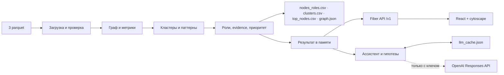

# Граф денег

**Русский** · [Қазақша (KZ)](README.kz.md) · [English (EN)](README.en.md)

**Объяснимый анализ сети банковских переводов для AML-аналитика.**
Кейс «Граф денег: восстановление финансовой структуры организованной группы по транзакционной сети»,
хакатон **HackAlem AI**, команда **Zzz Technology**.

Инструмент отвечает на вопрос аналитика: **«кого из 2 248 клиентов смотреть первым и почему»**.
По графу переводов от 81 известного участника (seed) он назначает каждому узлу роль, кластер и приоритет,
пишет обоснование с числами, показывает схему сети и позволяет проверить любой gid за десять секунд.

**Все выводы системы — гипотезы для проверки, а не доказательства нарушений.**

---

## Быстрый старт для жюри

Нужен только Docker с Compose и интернет на время сборки.

```bash
git clone https://github.com/BAITC-Hacks/hack-bf176827-zzz-technology.git
cd hack-bf176827-zzz-technology
docker compose up --build
```

Через 1–3 минуты (сборка) откройте **http://localhost:8080**. При старте контейнер сам выполняет
пайплайн, проверку выгрузок и поднимает интерфейс с API. Три CSV появятся на хосте в `out/`.
Остановка: `docker compose down`.

Без Docker (нужен Go 1.25+): `make demo` — пайплайн, проверка и сервер со встроенным просмотрщиком.
С React-интерфейсом дополнительно нужны Node.js 22+ и npm: `make demo-full`.

Пайплайн отрабатывает **менее секунды**, интернет и ключ LLM для воспроизведения не нужны.

## Соответствие ТЗ

| Требование | Где проверить |
|---|---|
| **Must have 1.** Один запуск от parquet до трёх выгрузок, < 5 мин | `docker compose up --build` или `make demo`; лог «готово за …ms»; `out/nodes_roles.csv`, `out/clusters.csv`, `out/top_nodes.csv` |
| **Must have 2.** 2 248 строк, роль из словаря, `role_score`, `evidence` | `make check` печатает распределение ролей и завершается с кодом 0 |
| **Must have 3.** Критерии ролей формальны и объяснимы | Таблица правил ниже и в [методологии](docs/methodology.md); в карточке узла метрики, сигналы и evidence с числами |
| **Must have 4.** Кластеры: размер, seed, оборот, гипотеза | `out/clusters.csv`, вкладка «Кластеры» в интерфейсе, `GET /v1/clusters` |
| **Must have 5.** Топ ≥ 20 с обоснованием и экран с направлением потоков | `out/top_nodes.csv` (30 строк), вкладка «Топ-30», поиск по gid, стрелки и подсветка входящих/исходящих |
| Явные ограничения данных учтены | Обрезанные обходом узлы не считаются стоками, seed не бывают транзитом и штрафуются в приоритете, см. раздел «Ловушки данных» |
| Артефакты | Репозиторий, README (ru/kz/en), три CSV, [схема решения](docs/scheme.png), [сценарий демо](docs/demo.md) |
| Запреты | Ни одного захардкоженного gid в правилах; ни одного чёрного ящика; внешних атрибутов клиентов нет; облако и платные сервисы для воспроизведения не нужны |
| Опционально | Обрыв обхода, временные паттерны, циклы и маршруты, дробление сумм, устойчивость сети, AI-ассистент, карточка узла, оценка полноты — см. [методологию](docs/methodology.md), разделы 6–9 |

## Что реализовано

**Аналитика (Go, детерминированно, < 1 с).**
- Загрузка трёх parquet и проверка: агрегированные рёбра сходятся с транзакциями по парам, числу и суммам.
- Метрики узла: связи и суммы в обе стороны, доля транзита, PageRank (взвешенный, своя реализация), HITS,
  посредничество, seed напрямую и выше по цепочке, кластеры на входе, компонента, признаки по датам
  (быстрый транзит за 2 дня, синхронные плательщики, активные дни), возвратные циклы, устойчивые маршруты,
  дробление сумм.
- Шесть ролей по правилам с порогами, `role_score`, кластеры Louvain, `priority_score` по перцентилям,
  `evidence` до 200 символов с числами.
- Устойчивость сети: что произойдёт при изъятии топ-5/10/20.
- Экспорт трёх CSV по схеме ТЗ и `graph.json`; валидатор выгрузок `cmd/check`.

**Интерфейс (React + cytoscape.js, отдаётся Go-сервером).**
- Схема сети: направление стрелок, цвет = роль, размер = приоритет, seed ромбом, обрезанные узлы пунктиром;
  при выборе узла входящие красные, исходящие тёмные, поток анимирован бегущим пунктиром.
- Поиск по полному gid или префиксу, фильтры по роли и кластеру, режимы «Топ-30» и «Вся сеть»,
  тумблер «Исключить периферию» прямо на схеме.
- Полоса выбранного узла: роль, получено, отправлено, удерживает, крупнейший перевод (кликабельный);
  наведение на «Получено» или «Отправлено» выводит это направление на передний план.
- Карточка узла: evidence, бейджи, ближайший seed выше по цепочке, «Куда смотреть дальше» (три кандидата),
  сигналы по 19 метрикам относительно всей сети, входящие и исходящие с отдельной группой «Периферия».
- Вкладки «Seed» (81 исходный участник и куда ушли деньги), «Топ-30», «Кластеры» с устойчивостью сети.
- Маршрут просмотренных узлов с номерами на схеме, «Назад» и «Очистить», сохраняется между сессиями.
- Уведомления, пустые состояния, скелетоны загрузки, тёмная тема по системной настройке.

**AI-слой (опционально, OpenAI).** Справка по узлу из четырёх блоков, гипотезы кластеров, ассистент с восемью
инструментами по графу и контекстом выбранного узла и маршрута. Всё кэшируется в `out/llm_cache.json`
(в репозитории), поэтому без ключа тексты воспроизводятся один в один.


## Как работает решение



1. Пайплайн читает `data/*.parquet`, строит направленный взвешенный граф.
2. Считает метрики, кластеры и паттерны; правила назначают роли, формула — приоритет; пишет CSV и `graph.json`.
3. Веб-сервер выполняет тот же расчёт в памяти при старте и отдаёт API и интерфейс.
4. Аналитик ищет gid или идёт по топ-листу, смотрит связи, обоснование, кандидатов и кластер.
5. При наличии ключа получает справку и задаёт вопросы; без ключа — те же тексты из кэша.

Роли и приоритеты считает локальный алгоритм. LLM получает готовые факты и **не назначает** роли,
кластеры или приоритеты. Два прогона пайплайна дают байт-в-байт одинаковые файлы.

### Критерии ролей и пороги

Для каждой роли считается скор 0–1 по правилу с порогом; роль узла — с наибольшим скором, `role_score` — этот скор.
Если ни одно правило не набрало 0.5, узел — `peripheral`. Пороги выведены из распределений на данных.

| Роль | Смысл | Условие | Скор | Кол-во |
|---|---|---|---|---|
| `consolidator` | собирает от многих и удерживает | плательщиков ≥ 3 | `min(1, in_deg/6) × (1 − min(1, pass_through))`, +0.15 если платят ≥ 2 seed; у обрезанных обходом ×0.7 | 31 |
| `coordinator` | связывает группы, кандидат в организаторы | вход ≥ 2, выход ≥ 2, betweenness ≥ P97, плательщики из ≥ 2 кластеров или ≥ 3 seed выше | `0.5 + 0.5·(0.5·btw/P99 + 0.25·кластеров/3 + 0.25·seed/5)` | 43 |
| `distributor` | веер на много получателей | получателей ≥ 5 и ≥ 2·плательщиков | `min(1, out_deg/30)`, ×0.6 если плательщиков ≥ 3 | 16 |
| `transit` | пропускает деньги насквозь | не seed, есть вход и выход, `0.7 ≤ pass_through ≤ 1.3` | `0.5 + 0.5·(1 − |pass_through − 1|/0.3) + 0.2·fast_forward_share` | 105 |
| `terminal` | деньги пришли и остались, подтверждено | нет исходящих, узел ≤ 3-го колена (обход шёл дальше), плательщиков ≥ 2 или сумма ≥ 100 000 | `0.5·min(1, in_kzt/500 000) + 0.5·min(1, in_deg/3)` | 153 |
| `peripheral` | признаков роли нет | иначе | `1 − max(остальных)` | 1 900 |

**Приоритет** — взвешенная сумма перцентильных рангов по сети:
`0.25·P(in_kzt) + 0.20·P(in_deg) + 0.15·P(seed выше) + 0.15·P(pagerank) + 0.10·P(betweenness) + 0.15·бонус роли`
(бонус: consolidator и coordinator 1.0, distributor 0.7, transit 0.5, terminal 0.4). Seed ×0.5 — они уже известны,
цель — те, кто выше; обрезанные обходом ×0.7 — данные неполные.

**Откуда взялись правила.** Всё это наша разработка: стартовый код организаторов считал только степени, суммы,
PageRank и `pass_through`, а ТЗ задавало словарь ролей и требование «формальное правило с порогом». Пороги выбраны
по квантилям на данных: ≥ 3 плательщика и ≥ 5 получателей — верхние 5 % узлов, окно транзита 0.7–1.3 покрывает
72 узла с пропуском 0.8–1.2, порог посредничества — P97. Приоритет считается по перцентилям, а не по сырым значениям,
чтобы одна сумма в 23 млн не задавила остальные факторы. Веса отражают порядок вопросов аналитика: куда стекаются
деньги важнее, чем кто посредник. Устойчивость проверена: при любых сдвигах шести весов на ±0.05 (729 комбинаций)
в топ-10 остаются не менее 7 узлов, в среднем 8.7, в топ-30 — не менее 26. Это эвристика без обучения: ground truth
нет, поэтому качество проверяется объяснимостью каждого решения.

**Evidence** — фраза до 200 символов по шаблону роли, например:
`консолидация: получает от 8 плательщиков (из них seed: 2) 2.2 млн KZT, отдаёт дальше 24% (2 получ.); в возвратном цикле`.

### Ловушки данных и как они учтены

| Особенность выгрузки | Решение |
|---|---|
| 444 узла 4-го колена без исходящих — обход просто закончился | флаг `truncated`; они никогда не `terminal`, скор консолидатора ×0.7, приоритет ×0.7, пометка в evidence |
| 1 091 узел 1–3 колена без исходящих — обход шёл дальше и ничего не нашёл | флаг `verified_sink`; только они могут быть `terminal` |
| У seed входящие занижены (граф собран от них) | seed не могут быть `transit`; приоритет ×0.5 |
| Порог 5 000 KZT, дробление ниже не видно | признак `structuring`: ≥ 5 входящих и ≥ 60 % из них до 15 000 KZT (45 узлов) |
| 16 компонент, 19 seed без рёбер | `component_id` у всех; изолированным seed — свой `cluster_id` |

## Сценарий проверки для жюри

1. Запустите `docker compose up --build`. В логе контейнера: распределение ролей и «готово за …ms»,
   затем «http server started». `make check` внутри уже прошёл.
2. Откройте http://localhost:8080. Стартовый вид — топ-30 с соседями. Слева сверху на схеме тумблер
   «Исключить периферию», справа легенда потоков.
3. Введите **`100000003115284100`** и нажмите «Найти». Это консолидатор №1: **8 входящих** (2 seed),
   **2 исходящих**, получено **2 160 500 KZT**, отправлено **517 000 KZT**, удерживает 76 %.
   На схеме входящие стрелки красные, исходящие тёмные; в карточке — evidence, ближайший seed
   в 1 шаге, три кандидата «Куда смотреть дальше», сигналы по метрикам.
4. Нажмите на контрагента в списке или на кандидата. Узел добавится в маршрут внизу схемы и получит
   номер на схеме. «Назад» возвращает к предыдущему.
5. Откройте вкладку «Seed»: 81 исходный участник и куда ушли их деньги. Вкладка «Кластеры»: устойчивость
   (изъятие топ-20 отрезает 17 % оборота, компонент 16 → 75) и 88 кластеров с гипотезами.
6. Сравните с `out/nodes_roles.csv`: gid, роль, `evidence` совпадают с интерфейсом.
   gid — 18-значные числа, в Excel открывать как текст.

Разбор пяти узлов «за минуту» и вопросы ассистенту: [docs/demo.md](docs/demo.md).

### Проверка через API

```bash
curl -f http://localhost:8080/v1/health
curl -f 'http://localhost:8080/v1/top?n=3'
curl -f http://localhost:8080/v1/nodes/100000003115284100
curl -f 'http://localhost:8080/v1/nodes/100000003115284100/ego?depth=2'
curl -f http://localhost:8080/v1/seeds
curl -f http://localhost:8080/v1/robustness
curl -f http://localhost:8080/v1/assistant/status
```

Swagger: http://localhost:8080/swagger/index.html. Все gid в JSON — строки: значения ≈ 1e17 не помещаются
в точный целочисленный диапазон JavaScript.

### Автоматические проверки

```bash
make pipeline   # out/*.csv, graph.json
make check      # 2248 узлов, роли из словаря, скоры в [0,1], evidence ≤ 200, кластеры, топ ≥ 20
make test       # Go: детерминизм анализа, ограничения ролей, фильтры графа, HTTP-контракты, инструменты ассистента
```

### Производительность

Замер на поставляемом наборе (2 248 узлов, 3 119 рёбер, 4 840 переводов), собранный бинарник, 5 прогонов подряд:

| Метрика | Результат | Требование ТЗ |
|---|---|---|
| Полный пересчёт от parquet до трёх CSV и `graph.json` | **0,29–0,33 с** | < 5 минут |
| Пиковая память (RSS) | ~60 МБ | обычный ноутбук |
| Детерминизм | 5 прогонов дают байт-в-байт одинаковые файлы | воспроизводимость |

Повторить: `go build -o bin/pipeline ./cmd/pipeline && /usr/bin/time -v bin/pipeline --data data --out out`.
Время сборки Go-бинарников и React-образа в Docker в замер не входит.

## Данные и результаты

Поставляемый набор: **1–31 июля 2026**, **2 248 клиентов, 3 119 рёбер, 4 840 переводов, 81 seed**,
оборот 365,9 млн KZT. Обход от seed по исходящим на 4 колена, только внутрибанковские переводы ≥ 5 000 KZT.

| Файл | Поля |
|---|---|
| `data/nodes.parquet` | `gid`, `depth`, `is_seed` |
| `data/edges.parquet` | `src`, `dst`, `sum_kzt`, `n_tx`, `depth` |
| `data/transactions.parquet` | `src`, `dst`, `date`, `sum_kzt` |

| Результат | Схема |
|---|---|
| `out/nodes_roles.csv` | `gid,role,role_score,cluster_id,priority_score,evidence` + 20 колонок метрик |
| `out/clusters.csv` | `cluster_id,n_nodes,n_seed,sum_kzt_internal,top_gids,hypothesis` + компонента, потоки через границу, циклы, состав ролей |
| `out/top_nodes.csv` | `rank,gid,role,priority_score,why` — 30 строк |
| `out/graph.json` | `nodes, edges, clusters, top, robustness` для интерфейса |
| `out/llm_cache.json` | кэш ответов LLM; коммитится, чтобы результат воспроизводился без ключа |

Итог на данных: 88 кластеров (8 с несколькими seed), топ-30 без единого seed, роли: 31 consolidator,
43 coordinator, 16 distributor, 105 transit, 153 terminal, 1 900 peripheral.

### HTTP API

| Метод и путь | Назначение |
|---|---|
| `GET /v1/health` | доступность сервера |
| `GET /v1/graph?role=&cluster=&component=&top=30` | граф с фильтрами; `top=N` — топ-N и их соседи, `top=0` — вся сеть |
| `GET /v1/nodes/{gid}` | карточка: метрики, перцентили, контрагенты, ближайший seed, кандидаты |
| `GET /v1/nodes/{gid}/ego?depth=1` | окружение в обе стороны, глубина 1–2 |
| `GET /v1/top?n=30` | топ приоритетов |
| `GET /v1/clusters` | кластеры с гипотезами |
| `GET /v1/seeds` | исходные участники и их крупнейшие получатели |
| `GET /v1/robustness` | устойчивость при изъятии топ-5/10/20 |
| `GET /v1/search?q=1000&limit=10` | поиск gid по префиксу |
| `GET /v1/assistant/status` | доступен ли LLM и какая модель |
| `GET /v1/nodes/{gid}/card` | текстовая справка по узлу (`by_llm: false` — шаблон) |
| `POST /v1/assistant` | `{"question": "...", "gid": "...", "route": ["..."]}` → `{answer, gids[]}`; 503 без ключа |
| `GET /graph.json` | последняя выгрузка, резервный источник интерфейса |

## Опциональный AI-слой

Единственная внешняя интеграция — **OpenAI Responses API**, модель по умолчанию `gpt-5.1`.
Ключ задаётся переменной `OPENAI_API_KEY` в окружении или в файле `.env` в корне репозитория
(шаблон — `.env.example`, `make env` создаёт его). Для Docker достаточно того же `.env` рядом с
`docker-compose.yaml`: compose подставит ключ в контейнер при `docker compose up`. При запросах во внешний API
уходят только обезличенные факты о графе и gid.

```bash
cp .env.example .env            # затем впишите OPENAI_API_KEY=sk-...
docker compose up --build       # или make demo — ключ подхватится автоматически
```

Без ключа работает всё, кроме новых вопросов ассистенту: роли, приоритеты, интерфейс, справки и гипотезы
из кэша или по шаблону. Интерфейс сам скрывает недоступные AI-элементы по ответу 503.

```bash
go run ./cmd/pipeline --data data --out out --llm    # дозапросить гипотезы кластеров, которых нет в кэше
go run ./cmd/ask --card 100000003115284100           # справка по узлу
go run ./cmd/ask --q 'Кто собирает деньги с seed 100000000343175100 и 100000003684369100?'
```

LLM ничего не решает про роли: промпт требует ссылаться только на gid, формулировать гипотезы и не
приписывать клиентам атрибуты, которых нет в данных.

## Технологии

| Компонент | Реализация |
|---|---|
| Бэкенд и CLI | Go 1.25, Fiber v2, Uber FX, Viper, zap, validator |
| Данные и графы | parquet-go, gonum (HITS, betweenness, Louvain), свой детерминированный PageRank |
| Фронтенд | React 19, Vite 7, cytoscape.js 3.30, CSS на токенах дизайн-системы, без CDN |
| API-документация | swag, Swagger UI |
| AI | OpenAI Responses API, файловый кэш |
| Запуск | Docker (один образ: React собирается внутри), Make |
| Хранение | parquet, CSV, JSON; результат анализа в памяти, без БД |

| Каталог | Назначение |
|---|---|
| `cmd/pipeline`, `cmd/check`, `cmd/web`, `cmd/ask` | пайплайн, валидатор, сервер, CLI ассистента |
| `internal/data/models`, `internal/data/graph`, `internal/repo/dataset` | модели, граф и индекс, чтение parquet |
| `internal/services/analysis` | метрики, роли, кластеры, приоритет, паттерны |
| `internal/services/{pipeline,export,graph,hypotheses,assistant}` | оркестрация, выгрузки, доступ для API, LLM-сценарии |
| `internal/transport/http`, `internal/data/dto` | хендлеры и JSON-контракты |
| `pkg/llm`, `pkg/httperr` | клиент OpenAI с кэшем, формат ошибок |
| `frontend` | React-интерфейс (`frontend/src`) |
| `web` | встроенный резервный просмотрщик |
| `docs` | методология, сценарий демо, схема, swagger |
| `tests` | black-box тесты анализа на реальных данных |

## Настройки

Несекретное — `config/base.yaml`, любой ключ переопределяется переменной окружения.

| Переменная | По умолчанию |
|---|---|
| `APP_PORT` | `8080` |
| `APP_DATA_DIR` / `APP_OUT_DIR` | `data` / `out` |
| `APP_ENVIRONMENT` | `local`; в Docker `prod` |
| `OPENAI_API_KEY` | пусто — LLM выключен |
| `LLM_MODEL` / `LLM_BASE_URL` | `gpt-5.1` / `https://api.openai.com/v1` |

Если порт 8080 занят: `APP_PORT=8081 make demo` или замените `"8080:8080"` на `"8081:8080"` в `docker-compose.yaml`.
Для разработки интерфейса: `make web` в одном терминале и `cd frontend && npm ci && npm run dev` в другом
(http://localhost:5173, прокси к API на 8080).

## Ограничения

- Видна только выгрузка: без входящих seed извне, без переводов < 5 000 KZT, без потоков за 4-м коленом
  и вне банка. Отсутствие исходящих у узла 4-го колена не означает, что деньги остались.
- Роли — правила с порогами, не разметка. Ground truth нет, поэтому качество проверяется объяснимостью,
  а не accuracy; `role_score` — уверенность правила, не вероятность вины.
- Кластеризация на неориентированной проекции; направление учтено в ролях, а не в группировке.
- Детекция аномалий ограничена правилом дробления сумм.
- Тексты LLM могут ошибаться и должны проверяться по фактам; без ключа новые вопросы недоступны.
- Авторизации нет: конфигурация для локальной демонстрации.

Каких данных не хватает и какие запросы закрывают белые пятна — [методология, раздел 9](docs/methodology.md).

## Масштабирование до ~1 млн узлов

Что изменится в подходе (реализация не требуется ТЗ):

- **Хранение.** Parquet в памяти заменяется колоночным хранилищем или графовой БД (Neo4j GDS, TigerGraph)
  либо Spark GraphFrames; 1 млн узлов и ~5 млн рёбер ещё помещаются в память Go, но пересчёт перестаёт быть секундами.
- **Метрики.** Степени, суммы и PageRank линейны. Betweenness O(V·E) заменяется аппроксимацией по сэмплу
  источников (Brandes–Pich) или локальным k-hop вариантом; циклы — длиной 3–4 и только вокруг кандидатов из топа.
- **Кластеры.** Louvain → Leiden, расчёт по компонентам параллельно.
- **Инкрементальность.** Новые выгрузки пересчитывают только затронутые компоненты; метрики хранятся с версиями,
  детерминизм сохраняется фиксированным порядком обхода.
- **Интерфейс.** Полный граф не рисуется: ego-подграфы и агрегаты по кластерам, серверная раскладка, индекс по gid.
- **LLM.** Те же инструменты ассистента поверх БД; кэш ответов с TTL.

## Материалы

- [Методология](docs/methodology.md): ловушки данных, метрики, правила ролей, кластеры, приоритет, паттерны, LLM, полнота, масштабирование.
- [Сценарий демо](docs/demo.md): пять узлов с разбором «за минуту», вопросы ассистенту, ответы на типовые вопросы жюри.
- [Схема решения](docs/scheme.png): данные → метрики → роли → интерфейс.
- [Интерфейс для разработки](frontend/README.md).

Публичный адрес развёрнутой версии не предоставляется; способ демонстрации — локальный запуск.
