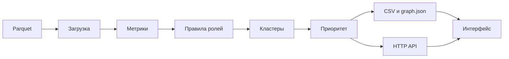
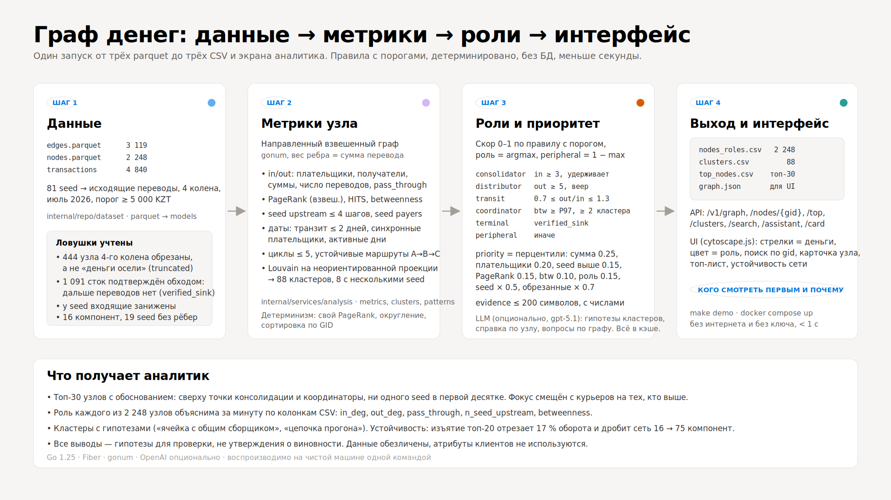

# hack-bf176827-zzz-technology
Hackathon team repository for Zzz Technology

## Запуск

Требуются Go 1.25.7+, Node.js 22.12+ (рекомендуется 24), npm и Make
либо Docker с Compose. Исходные Parquet находятся
в `data/`; после получения зависимостей приложение работает без интернета.
Первый `go run` и сборка Docker требуют доступа к реестрам зависимостей.

```sh
make demo
# Альтернатива:
docker compose up --build
```

`make demo` собирает React, затем последовательно выполняет анализ, проверку
CSV и запуск Go-сервера. Локально интерфейс: http://localhost:8080.
В Docker Compose интерфейс: http://localhost:3000, API: http://localhost:8080.
Swagger доступен по `/swagger/index.html` на обоих Docker-портах.
Compose запускает два сервиса: Go `app` и React/Nginx `frontend`.
Выгрузки: `out/` (Docker также сохраняет их в этот каталог хоста).
Остановка локального сервера — Ctrl+C, контейнера — `docker compose down`.

Для разработки UI: `cd frontend && npm ci && npm run dev`
(http://localhost:5173, прокси к API на 8080). Для повторного запуска
только Go-сервера — `make web`; на старте он самостоятельно
загружает Parquet и рассчитывает анализ в памяти. Настройки — `config/base.yaml`;
переопределения: `APP_PORT`, `APP_DATA_DIR`, `APP_OUT_DIR`, `APP_ENVIRONMENT`.
Секреты хранятся только в переменных окружения или локальном `.env`.

## Структура репозитория

| Путь | Назначение |
|---|---|
| `data/` | Исходные Parquet |
| `cmd/pipeline/` | Расчёт и экспорт |
| `cmd/check/` | Проверка трёх CSV |
| `cmd/web/` | HTTP-сервер и Docker entrypoint |
| `internal/analysis/`, `internal/graph/` | Аналитика и граф Артёма |
| `internal/services/graph/` | Индексы, фильтры, поиск и окружение |
| `internal/data/dto/` | JSON-контракт, gid строками |
| `internal/transport/http/v1/graph/` | HTTP-хендлеры |
| `frontend/` | React + Vite + Cytoscape, отдельный Dockerfile и Nginx |
| `web/` | Встроенный резервный просмотрщик этапа D0 |
| `docs/` | Swagger, скриншот и схема |

## Что на выходе

| Файл | Основные колонки / поля |
|---|---|
| `nodes_roles.csv` | `gid,role,role_score,cluster_id,priority_score,evidence` и метрики |
| `clusters.csv` | `cluster_id,n_nodes,n_seed,sum_kzt_internal,top_gids,hypothesis` и агрегаты |
| `top_nodes.csv` | `rank,gid,role,priority_score,why` |
| `graph.json` | `nodes,edges,clusters,top`; идентификаторы строками |

`make check` проверяет 2248 уникальных узлов, допустимые роли, score в [0,1],
непустой evidence до 200 символов, покрытие кластеров, минимум 20 ранжированных
узлов с невозрастающим приоритетом. Ошибка содержит файл и номер строки
для некорректной записи; процесс завершается с кодом 1.

## API

| GET | Назначение |
|---|---|
| `/v1/graph?role=&cluster=&component=&top=30` | Подграф; top-N плюс соседи одного шага, затем фильтры |
| `/v1/nodes/{gid}` | Узел с метриками и списками `incoming`, `outgoing` |
| `/v1/nodes/{gid}/ego?depth=1` | Окружение в обоих направлениях, глубина 1–2 |
| `/v1/top?n=30` | Приоритетные узлы |
| `/v1/clusters` | Кластеры и гипотезы |
| `/v1/search?q=1000&limit=10` | Поиск по началу gid |
| `/v1/health` | Состояние HTTP-сервера |
| `/graph.json` | Выгрузка пайплайна для резервного источника UI |

`top=0` или отсутствие `top` возвращает всю сеть. Пустые выборки — массивы `[]`.
Некорректные параметры дают 400, отсутствующий узел — 404.
Во всех JSON идентификаторы узлов передаются строками без потери точности.

## Интерфейс

Основной интерфейс написан на **React** и находится в `frontend/`.
Production-сборка `frontend/dist/` раздаётся Nginx в Compose либо Go-сервером
после `make demo`. Cytoscape включён в сборку, внешних CDN нет.

Стартовый экран показывает топ-30 с соседями. Полный gid или его префикс
в строке поиска → Enter → карточка и подсветка связей. Входящие стрелки
бирюзовые, исходящие оранжевые; остальные связи приглушены. Клик по соседу
открывает его карточку. «Ego 2 шага» догружает окружение, «Скопировать»
копирует карточку, если браузер разрешает доступ к буферу обмена.

Роль задаёт цвет, приоритет — размер, seed — форму ромба. Наведение
на ребро показывает сумму, на узел — полный gid. Доступны фильтры ролей
и кластеров, список приоритетов с обоснованиями и список кластеров.
«Вся сеть» загружает все узлы и фокусирует крупнейшую компоненту.

UI использует `/v1/*`; при недоступности API читает `graph.json` рядом
со страницей. Добавьте `?demo=1` к адресу React-интерфейса для явного включения
тестового графа из 10 узлов. Реальные ошибки API не подменяются моками.
При отсутствии React-сборки Go использует резервный просмотрщик `web/`.






Проверки: `make test`, `make fmt`, `go build ./...`, `make swag`;
для React — `cd frontend && npm test && npm run build`.
Подробнее о фронтенде: [frontend/README.md](frontend/README.md).

Текущая готовность и результаты проверок: [.agent/damir_ready.md](.agent/damir_ready.md).
Docker-прогон в рабочем окружении пока не выполнен: требуется включить
WSL integration в Docker Desktop. Сборка React и запуск через Go проверены.

Если терминал WSL унаследовал `GOROOT=//wsl.localhost/...` от Windows/IDE,
команды Makefile сбрасывают эту переменную только для запуска Go: SDK
определяется по Linux-бинарнику `go` из PATH. Для ручного `go run` выполните
`unset GOROOT`. `make demo` проверяет доступность Go до сборки фронтенда.
