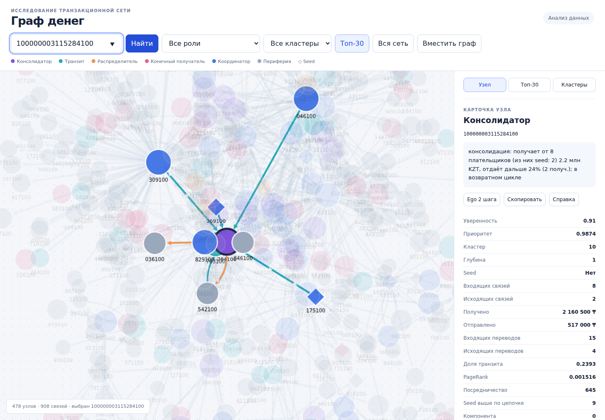

# Граф денег

**Русский** · [Қазақша (KZ)](README.kz.md) · [English (EN)](README.en.md)

**Объяснимый анализ сети банковских переводов для финансового мониторинга.**
Проект команды **Zzz Technology** для хакатона **HackAlem AI**.

«Граф денег» помогает аналитику понять, какие узлы транзакционной сети стоит
проверить в первую очередь: кто собирает деньги, передаёт их дальше, распределяет
между получателями или связывает группы. Для каждого клиента решение показывает
роль, приоритет и обоснование, которое можно сопоставить с переводами.

**Выводы системы — гипотезы для проверки, а не доказательства нарушений.**

## Что реализовано

- Загрузка трёх Parquet-файлов и проверка соответствия агрегированных рёбер
  исходным транзакциям по парам клиентов, количеству переводов и суммам.
- Расчёт метрик: входящие/исходящие связи и суммы, PageRank, HITS,
  посредничество, доля транзита, связь с исходными узлами обхода (`seed`),
  временные признаки активности.
- Присвоение одной из шести ролей, оценки `role_score`, кластера и
  `priority_score`; текстовое обоснование `evidence`.
- Кластеризация Louvain, поиск возвратных циклов длиной до пяти узлов,
  повторных маршрутов A → B → C и расчёт последствий исключения
  приоритетных узлов из сети.
- React-интерфейс: направленный граф, поиск по полному gid или префиксу,
  фильтры ролей и кластеров, топ-30, карточка клиента, переходы к соседям,
  окружение в один/два шага и копирование карточки.
- Экспорт трёх CSV и `graph.json`, отдельный валидатор результатов,
  HTTP API и Swagger.
- Опциональный AI-слой: справки по узлам, формулировки гипотез кластеров
  и ответы на вопросы через инструменты чтения графа.

| Роль | Интерпретация |
|---|---|
| `consolidator` | Собирает средства от нескольких плательщиков и удерживает значительную часть |
| `transit` | Передаёт дальше объём, сопоставимый с полученным |
| `distributor` | Распределяет средства между многими получателями |
| `terminal` | Конечный получатель в пределах наблюдаемой выгрузки |
| `coordinator` | Связывает группы и обладает высоким посредничеством |
| `peripheral` | Недостаточно признаков для остальных ролей |



## Как работает решение

1. Пайплайн читает `data/nodes.parquet`, `edges.parquet` и `transactions.parquet`.
2. Строит граф и считает метрики, кластеры и паттерны переводов.
3. Правила назначают роли; формула на основе перцентильных рангов метрик
   определяет приоритет проверки. Результаты сохраняются в `out/`.
4. Веб-сервер рассчитывает общий результат анализа в памяти и предоставляет API.
5. Аналитик открывает топ-30 или вводит gid клиента, изучает карточку,
   суммы и направления связей, переходит к контрагентам и расширяет окружение.
6. При необходимости получает текстовую справку или задаёт вопрос ассистенту.

Роли и приоритеты вычисляются локальным алгоритмом. LLM получает уже
рассчитанные факты и **не назначает** роли, кластеры или приоритеты.

Кластеризация выполняется на неориентированной проекции с весами по суммам
переводов и фиксированным seed. Приоритет учитывает входящий объём, число
плательщиков, seed выше по цепочке, PageRank, посредничество и роль.
Для seed и узлов на границе обхода применяются понижающие множители.
Формулы, пороги и трактовки описаны в [методологии](docs/methodology.md).

## Технологии

| Компонент | Реализация |
|---|---|
| Бэкенд и CLI | Go, версия модуля `1.25.7` |
| HTTP, зависимости и настройки | Fiber v2, Uber FX, Viper, godotenv, zap, validator |
| Данные и графовые алгоритмы | `parquet-go`, Gonum, собственные расчёты метрик и правил |
| Фронтенд | JavaScript, React 19, Vite 7, Cytoscape.js 3.30.4, CSS |
| Документация API | swag / fiber-swagger |
| AI | OpenAI Responses API; модель по умолчанию `gpt-5.1` в `config/base.yaml` |
| Сборка и запуск | Make, Docker, Docker Compose; Node.js на стадии сборки React |
| Хранение | Parquet, CSV, JSON; результат анализа в оперативной памяти, без БД |

Модель и адрес API задаются настройками `LLM_MODEL` и `LLM_BASE_URL`.
Cytoscape и React входят в локальную сборку: браузеру не нужны внешние CDN.

## Архитектура

```mermaid
flowchart LR
    D[Parquet-файлы] --> L[Загрузка и проверка]
    L --> M[Граф и метрики]
    M --> C[Кластеры и паттерны]
    C --> R[Роли и приоритеты]
    R --> E[Экспорт CSV и JSON]
    R --> A[Результат анализа в памяти]
    A --> API[Fiber API]
    API --> UI[React и Cytoscape]
    E -. резервный graph.json .-> UI
    A --> S[Сервис ассистента]
    S <--> K[JSON-кэш]
    S -. при наличии ключа .-> O[OpenAI Responses API]
    S --> API
```

В Docker используется **один сервис `app`**. React собирается в отдельной
стадии образа, затем Go раздаёт готовую статику и API на порту 8080.
Отдельные Nginx, Node-сервер и Postgres при таком запуске не требуются.

| Каталог | Назначение |
|---|---|
| `cmd/pipeline`, `cmd/check`, `cmd/web`, `cmd/ask` | Анализ, проверка выгрузок, сервер и CLI ассистента |
| `internal/app`, `internal/config` | Сборка зависимостей и конфигурация |
| `internal/repo/dataset` | Чтение и проверка Parquet |
| `internal/data/models`, `internal/data/graph` | Доменные модели, граф и индексы |
| `internal/services/analysis` | Метрики, роли, кластеры, приоритеты и паттерны |
| `internal/services/pipeline`, `export`, `graph` | Оркестрация, экспорт и доступ к результатам |
| `internal/services/assistant`, `hypotheses`, `pkg/llm` | AI-сценарии, клиент API и кэш |
| `internal/data/dto`, `internal/transport/http` | JSON-контракты и HTTP-хендлеры |
| `frontend` | Исходники React; сборка в `frontend/dist` |
| `web` | Встроенный резервный просмотрщик и тестовый граф |
| `data`, `out`, `docs`, `tests` | Входные данные, результаты, документация и тесты |

## Установка и запуск

### 1. Получить проект

```bash
git clone https://github.com/BAITC-Hacks/hack-bf176827-zzz-technology.git
cd hack-bf176827-zzz-technology
```

Запускайте команды из корня репозитория. При первом получении зависимостей
и сборке Docker нужен интернет. Основной анализ и просмотр сети после сборки
работают локально без ключа OpenAI.

### 2. Выбрать способ запуска

**Docker — без локальной установки Go и Node.js.** Нужны Docker Engine/Desktop
и Docker Compose; для Docker Desktop в WSL должна быть включена WSL integration.

```bash
docker compose up --build
# Или при наличии Make:
make docker
```

Образ содержит данные, сборку React и три Go-бинарника. При старте выполняются
пайплайн, проверка CSV и запуск веб-сервера. Каталог `out/` примонтирован с хоста:
туда записываются результаты и там хранится кэш LLM.

**Локально с React.** Нужны Go **1.25.7+**, Node.js **22.12+** (либо 24), npm и Make.

```bash
make demo-full
```

Команда устанавливает зависимости фронтенда, собирает React, запускает
`pipeline → check → web`. Выполняйте её без `-j`: сервер должен стартовать
после сборки интерфейса.

Для повторного запуска с уже собранным React:

```bash
make demo
```

`make demo` не собирает React. Если `frontend/dist/index.html` отсутствует,
сервер использует встроенный просмотрщик `web/`.

### 3. Открыть приложение

- Интерфейс: **http://localhost:8080**.
- Swagger: **http://localhost:8080/swagger/index.html**.
- Проверка доступности: **http://localhost:8080/v1/health**.
- Результаты анализа: каталог **`out/`**.

Локальный процесс работает в текущем терминале; остановка — `Ctrl+C`.
Для Docker: `docker compose down` или `make docker-down`.

### Разработка фронтенда

В первом терминале запустите API:

```bash
make web
```

Во втором:

```bash
cd frontend
npm ci
npm run dev
```

Vite откроет http://localhost:5173 и будет проксировать запросы к API на 8080.
Другой адрес бэкенда можно задать через `API_PROXY_TARGET`.

### Настройки и WSL

Несекретные настройки читаются из `config/base.yaml` и
`config/<APP_ENVIRONMENT>.yaml`. Основные переопределения:

| Переменная | Значение по умолчанию / назначение |
|---|---|
| `APP_PORT` | `8080`, порт локального Go-сервера |
| `APP_DATA_DIR` | `data`, каталог входных файлов |
| `APP_OUT_DIR` | `out`, каталог результатов и кэша |
| `APP_ENVIRONMENT` | `local`; в Docker задано `prod` |
| `OPENAI_API_KEY` | Необязательный ключ для новых LLM-запросов |
| `LLM_MODEL` | `gpt-5.1` |
| `LLM_BASE_URL` | `https://api.openai.com/v1` |

`.env` необязателен; `make env` создаёт его из `.env.example`, только если файла
ещё нет. Ключ не записывается в исходный код. В Compose явно передаётся
`OPENAI_API_KEY`; для других переопределений контейнера нужно изменить
`environment` и, при смене порта, `ports` в `docker-compose.yaml`.

В WSL используйте Linux-версии Node.js и Go, а не Windows npm на пути
`\\wsl.localhost\...`. Если унаследован Windows-путь `GOROOT`:

```bash
unset GOROOT
node -p 'process.platform'  # ожидается linux
command -v node
command -v npm
make demo-full
```

Если порт 8080 занят, остановите предыдущий экземпляр или локально выполните
`APP_PORT=8081 make demo-full` и откройте http://localhost:8081.

## Как проверить решение: сценарий для жюри

1. Запустите `make demo-full` либо `docker compose up --build`.
   Проверка CSV должна завершиться сообщением о **2248 уникальных узлах**.
2. Откройте интерфейс. Стартовый вид — топ-30 с соседями; цвета показывают роли,
   ромбы — seed, стрелки — направление переводов.
3. Введите **`100000003115284100`** и нажмите Enter или «Найти».
   В поставляемых данных это `consolidator`: **8 входящих** и **2 исходящих**
   контрагента, получено **2 160 500 KZT**, отправлено **517 000 KZT**.
   Должны появиться карточка и подсветка его связей.
4. Нажмите на соседа в карточке, затем «Ego 2 шага». Проверьте переход
   к другому узлу и расширение окружения.
5. Проверьте фильтры роли и кластера. Сбросьте оба фильтра и нажмите «Вся сеть»:
   для поставляемого набора ожидаются **2248 узлов и 3119 рёбер**.
6. Откройте `out/nodes_roles.csv` и сопоставьте gid, роль и обоснование
   с интерфейсом. Не преобразуйте gid в число с плавающей точкой.

Дополнительные примеры клиентов и вопросы для демонстрации:
[docs/demo.md](docs/demo.md).

### Проверка через API

Выполните во втором терминале после запуска сервера:

```bash
curl -f http://localhost:8080/v1/health
curl -f 'http://localhost:8080/v1/top?n=3'
curl -f http://localhost:8080/v1/nodes/100000003115284100
curl -f 'http://localhost:8080/v1/nodes/100000003115284100/ego?depth=2'
curl -f http://localhost:8080/v1/assistant/status
```

Полные метрики карточки находятся в `node.features`. Все gid в JSON — строки,
поскольку их значения превышают точный целочисленный диапазон JavaScript.
Ошибочный параметр даёт HTTP 400, неизвестный узел — 404.

### Автоматические проверки

```bash
make pipeline
make check
make test
go build ./...
cd frontend
npm ci
npm test
npm run build
```

`make check` проверяет число и уникальность узлов, словарь ролей, оценки в [0,1],
непустое обоснование до 200 символов, наличие кластеров и упорядоченный топ
из минимум 20 записей. При ошибке возвращается ненулевой код выхода.
Go-тесты проверяют, в частности, детерминизм анализа, ограничения ролей,
фильтры графа и HTTP-контракты; frontend-тесты — операции с графом.

## Данные, результаты и интеграции

В репозитории поставляется набор переводов за **1–31 июля 2026 года**:
**2248 клиентов, 3119 агрегированных направленных рёбер, 4840 транзакций,
81 seed**. Денежные суммы — в KZT.

| Источник | Поля Parquet |
|---|---|
| `data/nodes.parquet` | `gid`, `depth`, `is_seed` |
| `data/edges.parquet` | `src`, `dst`, `sum_kzt`, `n_tx`, `depth` |
| `data/transactions.parquet` | `src`, `dst`, `date`, `sum_kzt` |

Это файловая выгрузка: подключения к банковской системе или потоку живых
транзакций в проекте нет. Условия исходной выборки — обход от seed по исходящим
переводам на четыре шага и порог 5000 KZT — описаны в методологии.

| Результат | Основные поля |
|---|---|
| `out/nodes_roles.csv` | `gid,role,role_score,cluster_id,priority_score,evidence` и метрики |
| `out/clusters.csv` | `cluster_id,n_nodes,n_seed,sum_kzt_internal,top_gids,hypothesis` и агрегаты |
| `out/top_nodes.csv` | `rank,gid,role,priority_score,why` |
| `out/graph.json` | `nodes,edges,clusters,top,robustness` |
| `out/llm_cache.json` | Кэш текстовых ответов и гипотез |

Для текущих данных расчёт даёт **88 кластеров** и топ из **30 узлов**.
Распределение ролей: 31 consolidator, 43 coordinator, 16 distributor,
105 transit, 153 terminal, 1900 peripheral. Эти числа описывают поставляемый
набор, а не оценку точности модели.

### HTTP API

| Метод и путь | Назначение |
|---|---|
| `GET /v1/health` | Доступность сервера |
| `GET /v1/graph?role=&cluster=&component=&top=30` | Фильтрация графа; top-N с соседями одного шага |
| `GET /v1/nodes/{gid}` | Карточка с метриками и входящими/исходящими контрагентами |
| `GET /v1/nodes/{gid}/ego?depth=1` | Окружение в обоих направлениях, глубина 1–2 |
| `GET /v1/top?n=30` | Приоритетные узлы из рассчитанного топ-листа |
| `GET /v1/clusters` | Кластеры и гипотезы |
| `GET /v1/search?q=1000&limit=10` | Поиск gid по префиксу |
| `GET /v1/assistant/status` | Статус настройки LLM и модель |
| `GET /v1/nodes/{gid}/card` | Текстовая справка |
| `POST /v1/assistant` | Вопрос: `{"question":"..."}`; ответ с текстом и gid |
| `GET /graph.json` | Файл последней выгрузки для резервного источника UI |

У `/v1/graph` отсутствие `top` или `top=0` означает всю сеть.
`/v1/top` ограничен размером топ-листа, рассчитанного при старте.

### Опциональный AI-слой

Единственная внешняя AI-интеграция — **OpenAI Responses API**. Чтобы получать
новые ответы, задайте `OPENAI_API_KEY` в окружении или `.env` и перезапустите сервер.
При таких запросах факты о графе и идентификаторы узлов передаются внешнему API.

Без ключа:

- анализ, роли, приоритеты и интерфейс работают локально;
- гипотезы кластеров берутся из кэша либо формируются по шаблону;
- справка по узлу возвращается из кэша или по шаблону;
- ответ ассистента доступен, если вопрос найден в кэше; для нового вопроса API
  возвращает 503, а интерфейс скрывает недоступные AI-элементы после ответа 503.

Обычный пайплайн не запрашивает новые гипотезы у модели. Для явного включения:

```bash
go run ./cmd/pipeline --data data --out out --llm
# Справка по узлу через CLI, работает и без ключа:
go run ./cmd/ask --card 100000003115284100
# Новый вопрос требует ключа, если ответа нет в кэше:
go run ./cmd/ask --q 'Какие узлы имеют наибольший приоритет и почему?'
```

## Ограничения текущей версии

- Видна только предоставленная выборка: нет полной истории клиента,
  переводов ниже порога и потоков за пределами обхода. Отсутствие исходящих
  у узла четвёртого шага не доказывает, что деньги остались у него.
- Роли основаны на эвристиках. Эталонной разметки для измерения accuracy в
  репозитории нет; `role_score` не является доказанной вероятностью нарушения.
- Анализ выполняется в памяти при запуске. Промышленное масштабирование,
  потоковое обновление и загрузка новых файлов через UI не реализованы.
  Валидатор `cmd/check` привязан к 2248 узлам хакатонного набора.
- Кластеризация использует неориентированную проекцию; направление сохраняется
  в графе переводов, но не в этом этапе группировки.
- Раскладка полной сети может занимать заметное время. По умолчанию используется
  меньший подграф топ-30 с соседями; время зависит от компьютера и браузера.
- Карточка React отображает базовые метрики; полный набор доступен в
  `node.features` API. Не все вложенные метрики сейчас выведены в UI.
- Авторизация пользователей и разграничение доступа не реализованы.
  Текущая конфигурация предназначена для локальной демонстрации.
- Новые AI-ответы требуют внешнего API и ключа; тексты могут ошибаться и должны
  проверяться по исходным фактам. Собственная обученная ML-модель не поставляется.

## Развёрнутая версия

**Публичный адрес развёрнутой версии в репозитории не указан.**
Подтверждённый способ демонстрации — локальный запуск на http://localhost:8080.

Дополнительные материалы: [методология](docs/methodology.md),
[сценарий демонстрации](docs/demo.md), [схема решения](docs/scheme.png).
